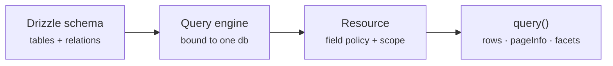
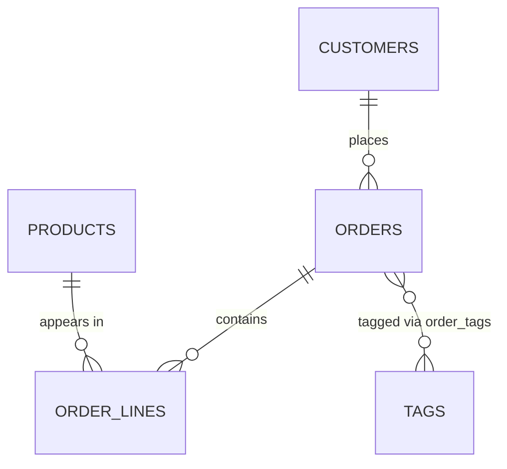

`drizzle-resource` turns a Drizzle table into a **query resource**: one typed contract that handles filtering, text search, sorting, pagination, row hydration, and facet counts.

You declare the resource once. Every endpoint built on it accepts the same request shape and returns the same response shape, and the server — not the client — decides which fields are reachable.

## The endpoint it replaces

Every table API converges on the same handler. Parse sort params, whitelist them, assemble a `WHERE` clause, run a count, hydrate relations, then group buckets for the filter sidebar:

```ts
// The shape this library removes — rewritten slightly differently for every table
const sortKey = ALLOWED_SORTS.includes(query.sort) ? query.sort : "created_at";
const where = [eq(orders.orgId, ctx.orgId)];
if (query.status) where.push(inArray(orders.status, query.status.split(",")));
if (query.q) where.push(like(sql`lower(${orders.reference})`, `%${query.q}%`));

const [rows, [{ total }], statusBuckets] = await Promise.all([
  db
    .select()
    .from(orders)
    .where(and(...where))
    .orderBy(sortKey)
    .limit(size)
    .offset(page * size),
  db
    .select({ total: count() })
    .from(orders)
    .where(and(...where)),
  db
    .select({ value: orders.status, n: count() })
    .from(orders)
    .where(and(...where))
    .groupBy(orders.status),
]);
```

Nothing there is hard. It is just written from scratch on every table, drifts between endpoints, and forces the client to learn a new payload each time.

A resource replaces all of it with a declaration:

```ts twoslash
import { engine } from "./engine";
// ---cut-before---
export const ordersResource = engine.defineResource("orders", {
  relations: { customer: true },
  query: {
    scope: (f, ctx) => f.is("customer.orgId", ctx.orgId),
    search: { allowed: ["reference", "customer.name"], defaults: ["reference"] },
    sort: { defaults: [{ key: "createdAt", dir: "desc" }] },
    facets: { allowed: ["status", "customer.name"] },
  },
});
```

The tenant filter now merges into every query before any client input, and `status` is facetable without a second endpoint.

## The three building blocks



An **engine** binds to one Drizzle connection and its schema. A **resource** picks a root table, declares which relations to load, and sets the field policy. Calling **`query()`** runs the staged pipeline and returns hydrated rows with page metadata.

## The example domain

Every example in these docs uses one orders schema, so field paths mean the same thing on every page:



`orders` is the root. `customer` is a single required relation, `orderLines` is one-to-many, `orderLines.product` is a single relation behind that, and `tags` is many-to-many through a junction table.

That mix is deliberate — relation **cardinality** changes what each field path can do, which is the subject of [Relation Model](/core-concepts/relation-model).

## What it does not do

- It is **Postgres only**. The SQL compiler is built on `drizzle-orm/pg-core`.
- It does not write. There is no create, update, or delete surface.
- It does not replace Drizzle. Every resource is a thin layer over your existing schema and relations, and you can drop to raw Drizzle in any pipeline stage.
- It is not a full-text search engine. Matching is `lower(col) LIKE '%value%'`, which is right for filter bars and wrong for ranked relevance search.

## When it fits

Reach for a resource when a table is read through a UI that needs several of these at once — a filter bar, sortable columns, a search box, pagination, and bucket counts. The more of those an endpoint carries, the more the declaration saves.

Skip it for a single-purpose read that will never grow filters. A hand-written Drizzle query is shorter and clearer.

## Next steps

- [Installation](/getting-started/installation) — peer versions and what your Drizzle setup must expose
- [Quick Start](/getting-started/quick-start) — engine, resource, and first query
- [First Endpoint](/getting-started/first-endpoint) — a complete validated HTTP handler
- [Query Pipeline](/core-concepts/query-pipeline) — the five stages every query runs
