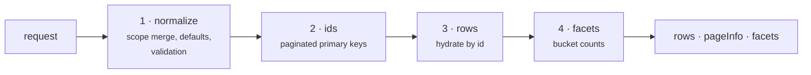
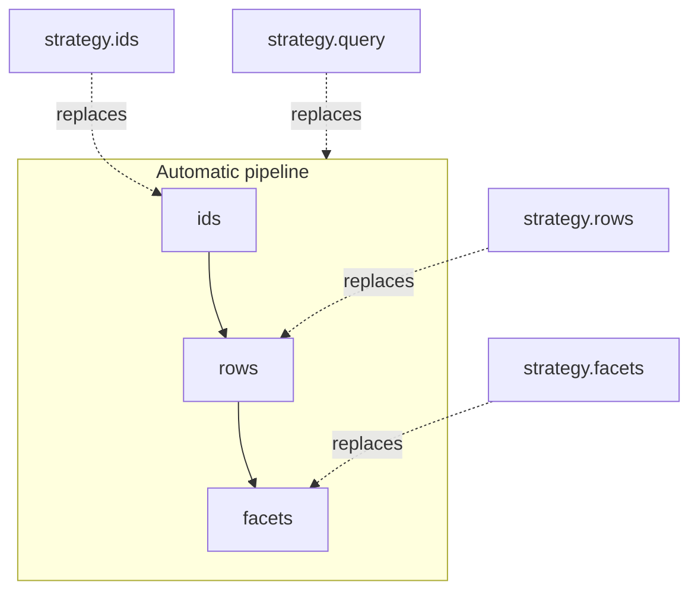

A resource is not one large query. `query()` runs four ordered stages, and each stage is independently replaceable.

This page is the canonical vocabulary for those stages. Every other page uses these names.

The stages run **sequentially**, not in parallel. Each one depends on the output of the one before it.

## 1 · Normalize

Nothing touches the database yet. This stage turns a client payload into a trusted, complete request:

1. **Scope merge** — the resource's `scope` function runs and its filters are merged into `request.filters`.
2. **Defaults** — pagination mode and `count` policy resolve, empty `sorting` falls back to `sort.defaults`, empty `search.fields` falls back to `search.defaults`.
3. **Cursor tiebreaker** — in cursor mode the engine appends `{ key: "id" }` to the sort unless `id` is already there.
4. **Limits** — page size, cursor length, filter depth, filter node count, and facet caps are enforced.
5. **Field validation** — every sort key, filter key, and search field must exist in the registry and be allowed.

Order matters here. Scope filters merge **before** validation, which is why a scope filter that references a hidden or disabled path fails — see [Scope Rules](/resource-setup/scope).

## 2 · Ids

One query selects the primary keys for the page, with every filter, the search predicate, and the ordering applied.

Selecting ids first keeps the expensive part narrow: joins and `EXISTS` subqueries run against a single indexed column instead of against every hydrated field.

Offset mode issues `LIMIT`/`OFFSET` and, when `count: "exact"`, a second count query. Cursor mode issues a keyset predicate and fetches `pageSize + 1` rows to decide whether another page exists — no count query unless you ask for one.

Override this stage with `strategy.ids` when the join shape or the pagination needs hand-tuning.

## 3 · Rows

The page ids go into a Drizzle relational query that hydrates the declared relations and preserves the ids order.

This stage is **skipped entirely when the ids stage returns nothing** — an empty page costs one query, not two.

Override it with `strategy.rows` when you want to hydrate from a cache or reshape the selection.

## 4 · Facets

Facets resolve only when `request.facets` is non-empty. Every requested facet shares one `matchingIds` CTE per scope group, so adding a second facet on the same scope does not re-run the matching query.

Override this stage with `strategy.facets`, or replace ids and rows together with `strategy.query`.

::note
`strategy.query` replaces stages 2 and 3. Facets still run afterwards unless your strategy returns a `facets` array itself.
::

## What each stage costs

| Stage     | Queries                      | Grows with                                             |
| --------- | ---------------------------- | ------------------------------------------------------ |
| Normalize | 0                            | Nothing — pure computation                             |
| Ids       | 1, plus 1 for an exact count | Filter and search complexity, join depth, offset depth |
| Rows      | 1, or 0 on an empty page     | Page size and declared relation breadth                |
| Facets    | 1 per requested facet        | Facet count and the cardinality of each faceted path   |

[Execution Cost](/performance/execution-cost) breaks this down per relation cardinality.

## Mapping overrides to stages

Start with the automatic pipeline. Replace a single stage only after a measurement shows which one is expensive — [Optimization](/performance/optimization) covers the order to try things in.

## Next steps

- [Field Paths](/core-concepts/field-paths) — how the registry validation in stage 1 is built
- [Relation Model](/core-concepts/relation-model) — why cardinality changes what each stage can do
- [Strategies](/resource-setup/strategies) — writing a real stage override
- [Execution Cost](/performance/execution-cost) — where time goes inside each stage
