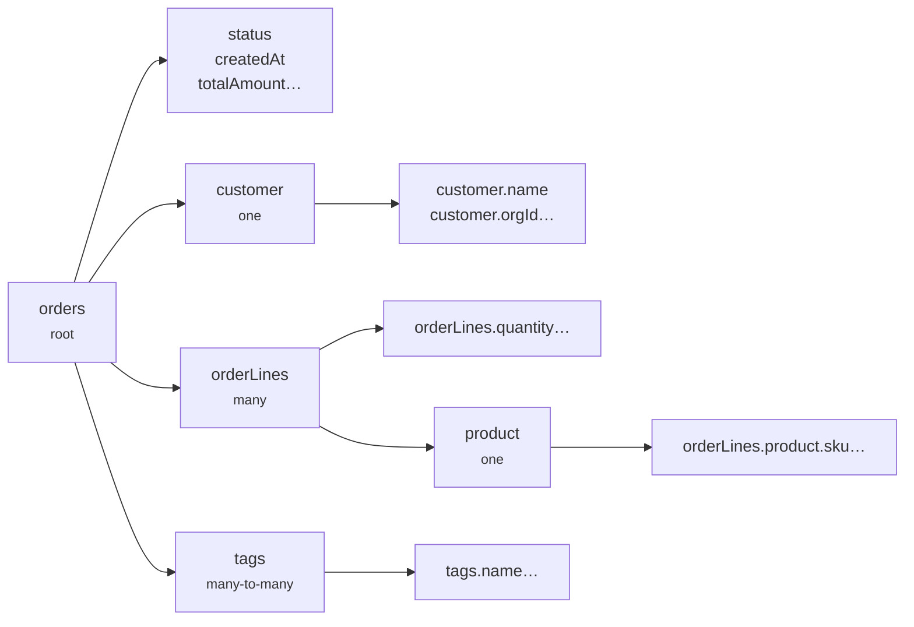

A **field path** is a dotted string that names one column reachable from the resource root — `status`, `customer.name`, `orderLines.product.sku`.

Field paths are the only vocabulary a client has. Filters, search, sorting, and facets all address columns this way, and every path is validated against a registry the resource builds at definition time.

## How the registry is built

`defineResource` walks the relation tree you declared and registers every column it reaches:



Only declared relations are walked. A relation that exists in your Drizzle schema but is absent from the resource's `relations` contributes no paths — the client cannot reach it, by construction.

```ts twoslash
import { ordersResource } from "./twoslash-support";
// ---cut-before---
// Every registered path, with its metadata
const status = ordersResource.fields.get("status");
const nested = ordersResource.fields.get("orderLines.product.sku");
```

## What a registry entry carries

Each entry records enough to compile SQL for that path:

::field-group
::field{name="path" type="string"}
The dotted path itself.
::
::field{name="column" type="PgColumn"}
The underlying Drizzle column.
::
::field{name="relationPath" type="FieldRegistryRelationStep[]"}
Each relation hop taken to reach the column, with its cardinality.
::
::field{name="isManyPath" type="boolean"}
True when any hop is a `many` relation. Filters on these paths compile to `EXISTS` subqueries.
::
::field{name="sortable" type="boolean"}
False when any hop is a `many` relation, or when the path is listed in `sort.disabled`.
::
::

## Sortability is derived, not configured

A path is sortable only when it crosses **no `many` relation**:

```ts twoslash
import { ordersResource } from "./twoslash-support";
// ---cut-before---
ordersResource.fields.get("createdAt")?.sortable; // true  — root column
ordersResource.fields.get("customer.name")?.sortable; // true  — single relation
ordersResource.fields.get("orderLines.quantity")?.sortable; // false — behind a many relation
ordersResource.fields.get("tags.name")?.sortable; // false — many-to-many
```

This is structural. One order has many lines, so "sort orders by line quantity" has no single value to sort on. Listing such a path in `sort.disabled` changes nothing, because it was never sortable.

[Relation Model](/core-concepts/relation-model) covers the full set of consequences.

## Policy removes paths from the registry

Two config keys delete paths outright rather than flagging them:

```ts twoslash
import { engine } from "./engine";
// ---cut-before---
const orders = engine.defineResource("orders", {
  relations: { customer: true },
  query: {
    filters: {
      hidden: ["customer.orgId"], // removed from the registry
      disabled: ["deletedAt"], // also removed from the registry
    },
  },
});
```

Both keys have the same effect on the registry — the path is gone. A request naming it fails with `Unknown filter field "…"`.

::warning
Because the path is gone, **a scope function cannot reference a hidden or disabled path either**. Scope filters merge into the request before validation runs, so they are checked against the same registry. See [Scope Rules](/resource-setup/scope).
::

## Paths are typed

The path union is inferred from your schema and declared relations, so an invalid path is a compile error rather than a runtime failure:

```ts twoslash
// @errors: 2345
import { f } from "./twoslash-support";
// ---cut-before---
f.is("customer.name", "Acme"); // ok
f.is("customer.orgg", "acme"); // typo — caught at compile time
```

[Type Safety](/core-concepts/type-safety) shows how to reuse that union in your own code.

## Next steps

- [Relation Model](/core-concepts/relation-model) — how cardinality changes each capability
- [Field Policy](/resource-setup/field-policy) — which paths to expose, and how
- [Type Safety](/core-concepts/type-safety) — deriving the path union for client and server code
