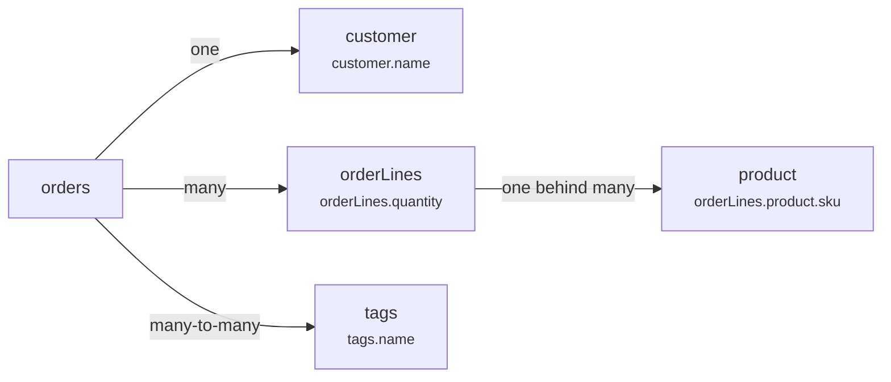

Relation **cardinality** is the single most consequential thing about a field path. It decides whether the path can be sorted, what SQL a filter on it compiles to, how it hydrates onto a row, and what a facet count on it means.

This page is the canonical explanation. Other pages state the rule for their own capability and link here.

## The short version

- A path crossing **no `many` relation** behaves like a root column: sortable, filterable with a plain comparison, hydrated as a nested object.
- A path crossing **any `many` relation** is **not sortable at all**, filters through an `EXISTS` subquery, hydrates as an array, and counts with `count(distinct)`.
- Many-to-many is just a `many` relation with a junction table. Same rules, more join depth.

## The three shapes



`orderLines.product.sku` matters most here. The last hop is a single relation, but the path already crossed `orderLines`, so the whole path counts as a many path. **Cardinality is decided by the first `many` hop, not the last one.**

## What changes, capability by capability

|           | Single relation             | Any `many` relation                                     |
| --------- | --------------------------- | ------------------------------------------------------- |
| Sorting   | Allowed                     | **Impossible** — the path is not sortable               |
| Filtering | `INNER JOIN` + comparison   | `EXISTS (SELECT 1 …)` subquery                          |
| Search    | Joined predicate            | `EXISTS` subquery per field                             |
| Hydration | Nested object               | Array of rows                                           |
| Facets    | `count(distinct orders.id)` | `count(distinct orders.id)` — same, but more join depth |

## Sorting

A many path has no single value per root row, so there is nothing to order by:

```ts twoslash
import { ordersResource } from "./twoslash-support";
// ---cut-before---
ordersResource.fields.get("customer.name")?.sortable; // true
ordersResource.fields.get("orderLines.quantity")?.sortable; // false
```

Sending a non-sortable sort key throws:

```
Sorting field "orderLines.quantity" is not allowed for resource "orders"
```

::warning
This is structural, not a policy you can relax. Adding a many path to `sort.disabled` is a no-op — it was never sortable. If you need "orders sorted by total quantity", denormalize that total onto `orders` and sort on it, or write a `strategy.ids` that aggregates.
::

## Filtering

A filter on a many path asks "does at least one related row match", which is an `EXISTS` subquery rather than a join:

```ts twoslash
import { f } from "./twoslash-support";
// ---cut-before---
// Orders that contain at least one line for a laptop
f.is("orderLines.product.category", "laptops");
```

That compiles to roughly:

```sql
EXISTS (
  SELECT 1 FROM order_lines
  INNER JOIN products ON order_lines.product_id = products.id
  WHERE order_lines.order_id = orders.id
    AND lower(products.category) = 'laptops'
)
```

The subquery keeps each root row counted once. A join would multiply rows by the number of matching lines and corrupt both pagination and counts.

::note
The engine only ever emits `INNER JOIN`. There is no `LEFT JOIN` in the compiler, so a filter on a single relation also requires the related row to exist.
::

## Hydration

Cardinality carries straight through to the row type:

```ts twoslash
import { ordersResource } from "./twoslash-support";

const result = await ordersResource.query({
  context: { orgId: "acme" },
  request: {
    pagination: { mode: "offset", pageIndex: 1, pageSize: 25 },
    sorting: [],
    search: { value: "", fields: [] },
    filters: [],
  },
});
const row = result.rows[0]!;
// ---cut-before---
row.customer;
//  ^?
row.orderLines;
//  ^?
```

A single relation is one object, a many relation is an array — matching Drizzle's own relational output.

## Facets

Every facet counts distinct root ids, whatever the cardinality:

```sql
count(distinct matching_ids.id)
```

That choice is what makes a many-path facet meaningful. Faceting `tags.name` answers "how many **orders** carry this tag", not "how many tag rows exist". An order tagged twice with the same tag still counts once.

The cost difference is join depth, not counting strategy — see [Execution Cost](/performance/execution-cost).

## Many-to-many

A junction table adds one hop and nothing else. Declare it with Drizzle's `through`:

```ts twoslash [relations.ts]
import { defineRelationsPart } from "drizzle-orm";

import { schema } from "./schema";
// ---cut-before---
export const relations = defineRelationsPart(schema, ({ orders, orderTags, tags, many }) => ({
  orders: {
    tags: many.tags({
      from: orders.id.through(orderTags.orderId),
      to: tags.id.through(orderTags.tagId),
    }),
  },
  tags: {},
  orderTags: {},
}));
```

`tags.name` is then filterable, searchable, and facetable — and not sortable, like any other many path.

## Practical checklist

- Need to sort by something behind a `many` relation? Denormalize it onto the root table.
- Filtering a many path costs one `EXISTS` subquery per condition. Index the junction and foreign-key columns.
- Faceting a many path is the most expensive thing a resource does. Cap it with `limit` and measure before exposing it.
- Declare only the relations a resource needs. Every extra relation widens the registry and the hydration query.

## Next steps

- [Field Paths](/core-concepts/field-paths) — how paths are registered and validated
- [Sort Order](/query-contract/sorting) — what a client may sort on
- [Facet Counts](/query-contract/facets) — modes, limits, and bucket pagination
- [Execution Cost](/performance/execution-cost) — the price of each cardinality
