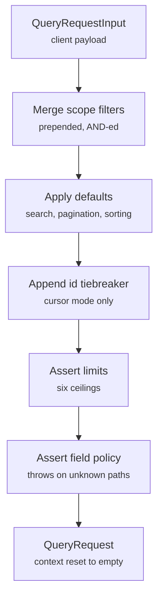

A query request is five keys: `pagination`, `sorting`, `filters`, `search`, and `facets`.

Clients send `QueryRequestInput`. The engine normalizes it into `QueryRequest` — merging scope, filling defaults, then asserting the field policy — before any SQL is built.

## The two types

`QueryRequestInput` is the transport type. It is what a request body parses into and what `resource.query({ request })` accepts:

```ts twoslash
import { ordersResource } from "./orders.resource";
// ---cut-before---
await ordersResource.query({
  context: { orgId: "acme" },
  request: {
    pagination: { mode: "offset", pageIndex: 1, pageSize: 25 },
    sorting: [{ key: "createdAt", dir: "desc" }],
    filters: [],
    search: { value: "laptop", fields: [] },
    facets: [{ key: "status" }],
  },
});
```

`QueryRequest` is the normalized form. Strategies receive it, never the raw input — see [Strategies](/resource-setup/strategies).

## The payload

::field-group
::field{name="pagination" type="QueryPaginationInput" required}
Offset or cursor page selector, discriminated on `mode`. `pageSize` is always required. `mode` may be omitted, in which case the request is **offset**. See [Pagination](/query-contract/pagination).
::

::field{name="sorting" type="QuerySortDescriptor[]" required}
Sort descriptors applied left to right. An empty array falls back to the resource's `sort.defaults`. See [Sort Order](/query-contract/sorting).
::

::field{name="filters" type="QueryFilterNode[]" required}
Top-level condition and group nodes, combined with an implicit `and`. An empty array leaves only the scope filter. See [Filter Trees](/query-contract/filters).
::

::field{name="search" type="QuerySearchRequest" required}
Free-text input. An empty `value` skips search entirely; an empty `fields` array falls back to the resource's `search.defaults`. See [Text Search](/query-contract/search).
::

::field{name="facets" type="QueryFacetRequest[]"}
Optional bucket counts resolved alongside the page. Omit the key to skip facet resolution. See [Facet Counts](/query-contract/facets).
::

::field{name="context" type="Record<string, unknown>"}
**Deprecated.** The engine overwrites it with `{}`. Pass trusted state as the sibling `context` argument instead.
::
::

The first four keys are required by the type, not by the wire format. A generated `requestSchema` defaults every one of them, so `parse({})` yields a complete request:

```ts twoslash
import type { QueryRequestInput } from "drizzle-resource";

import { ordersResource } from "./orders.resource";

const minimal: QueryRequestInput = {
  pagination: { pageIndex: 1, pageSize: 25 },
  sorting: [],
  filters: [],
  search: { value: "", fields: [] },
};

await ordersResource.query({ context: { orgId: "acme" }, request: minimal });
```

That request runs with the resource's default sort, default search fields, and `count: "exact"`.

## Normalization order

The order matters, because each step can make the next one throw:



1. **Scope merge** — `query.scope(filters, context)` runs, and its node is prepended to `filters`. The client cannot see or displace it.
2. **Search defaults** — an empty `search.fields` becomes the resource's `search.defaults`.
3. **Pagination defaults** — a non-positive `pageIndex` or `pageSize` falls back to `defaults.pagination`, and an absent `count` becomes `"exact"` for offset or `"none"` for cursor.
4. **Sorting defaults** — an empty `sorting` array becomes the resource's `sort.defaults`.
5. **Cursor tiebreaker** — cursor mode appends `{ key: "id" }` when no `id` descriptor is present.
6. **Limits** — the six ceilings are asserted, page size and cursor length first.
7. **Field policy** — pagination mode, sort keys, search fields, and every filter key are checked against the resource.

Step 1 running before step 7 is the reason a scope filter on a hidden or disabled path throws `Unknown filter field` — the scope node is validated exactly like a client node.

Facet keys are the one exception. They are checked when the facet stage runs, which in `query()` is **after** the ids and rows queries, so an unknown facet key fails a request that already hit the database. A validator catches it up front instead.

::caution
Never hide or disable a field path your `scope` filters on. `filters.hidden` and `filters.disabled` both delete the path from the registry, and the merged scope condition then fails validation on every request. See [Scope Rules](/resource-setup/scope).
::

## What the server ignores

`request.context` is discarded. Normalization replaces it with `{}`, so a strategy reading `request.context` always sees an empty object — the trusted value arrives as the sibling `context` argument:

```ts twoslash
import { ordersResource, requestInput } from "./twoslash-support";
// ---cut-before---
await ordersResource.query({
  // Trusted, server-derived, never from the request body
  context: { orgId: "acme", isAdmin: false },
  request: requestInput,
});
```

A generated `requestSchema` is a `strictObject`, so a body that carries `context` is rejected rather than silently stripped.

Two more things pass through untouched. An omitted `pagination.mode` is read as `"offset"`, and `facets` is not normalized at all — each facet's `mode` defaults to `exclude-self` later, when the facet resolver runs.

## Next steps

- [Filter Trees](/query-contract/filters) — the node types and all eleven operators
- [Pagination](/query-contract/pagination) — both modes, the count policy, and cursor rules
- [Request Limits](/resource-setup/limits) — the six ceilings and their defaults
- [Validation](/integration/validation) — turning a resource into a Zod or Valibot schema
