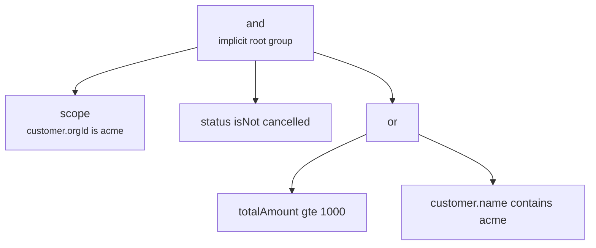

`filters` is an array of nodes. Every node is either a **condition** on one field path or a **group** that combines other nodes.

Top-level entries are combined with an implicit `and`, so the array is already a boolean tree with an `and` root:



That tree matches orders in the caller's org, not cancelled, and either large or placed by Acme.

## The two node types

A condition names a field path, an operator, and a value:

```ts twoslash
import type { QueryFilterCondition } from "drizzle-resource";
import type { MyFieldPaths } from "./twoslash-support";

const condition: QueryFilterCondition<MyFieldPaths> = {
  type: "condition",
  key: "status",
  operator: "is",
  value: "pending",
};
```

Typing the node against the resource's derived field-path union rejects `key: "statuz"` at compile time.

A group carries a combinator and children, and a child may be another group:

```ts twoslash
import type { QueryFilterGroup } from "drizzle-resource";
import { f, type MyFieldPaths } from "./twoslash-support";

const group: QueryFilterGroup<MyFieldPaths> = {
  type: "group",
  combinator: "or",
  children: [f.gte("totalAmount", 1000), f.contains("customer.name", "acme")],
};
```

An empty `children` array compiles to `true`, which matches every row rather than none.

## The eleven operators

Each operator compiles straight to a Drizzle fragment. There is no `ILIKE` and no `IN` anywhere in the compiler:

| Operator   | Compiled SQL                                                        | Value                            |
| ---------- | ------------------------------------------------------------------- | -------------------------------- |
| `contains` | `lower(col) like '%value%'`                                         | scalar, lowercased               |
| `is`       | `lower(col) = 'value'` on text, `col = value` otherwise             | scalar; an array uses `value[0]` |
| `isNot`    | `not (lower(col) = 'value')` on text, `not (col = value)` otherwise | scalar; an array uses `value[0]` |
| `isAnyOf`  | `(col = a or col = b or …)`                                         | array; `[]` compiles to `false`  |
| `gt`       | `col > value`                                                       | scalar                           |
| `gte`      | `col >= value`                                                      | scalar                           |
| `lt`       | `col < value`                                                       | scalar                           |
| `lte`      | `col <= value`                                                      | scalar                           |
| `between`  | `col between from and to`                                           | `{ from?, to? }`                 |
| `before`   | `col < value`                                                       | scalar — alias of `lt`           |
| `after`    | `col > value`                                                       | scalar — alias of `gt`           |

Three details decide whether a filter behaves the way a client expects.

**Case sensitivity follows the column type.** `contains`, `is`, `isNot`, and `isAnyOf` lowercase both sides only for `varchar`, `text`, `char`, and `citext` columns. `f.is("status", "PENDING")` therefore matches a stored `pending`, while `f.is("id", "ABC")` stays exact — `uuid` is not a text type.

**Non-text columns are cast for `contains`.** A `contains` on `totalAmount` compiles to `lower(cast(totalAmount as text)) like '%12%'`, so numeric substring search works but cannot use a plain b-tree index.

**Booleans are inlined.** `is`, `isNot`, and `isAnyOf` write `col = true` literally instead of binding a parameter.

## Values that match nothing

`between` takes an object with optional bounds, and one-sided ranges are supported:

```ts twoslash
// @errors: 2559
import { f, ordersResource, requestInput } from "./twoslash-support";
// ---cut-before---
await ordersResource.query({
  context: { orgId: "acme" },
  request: {
    ...requestInput,
    filters: [
      f.between("totalAmount", { from: 1000, to: 5000 }),
      f.between("createdAt", { from: "2026-01-01" }),
    ],
  },
});

// A tuple was never the value shape — the builder rejects it
f.between("createdAt", ["2026-01-01", "2026-01-31"]);
```

A raw payload bypasses that check, and a tuple then compiles to `false` and matches nothing. `isAnyOf` with an empty array does the same, as does an `or` group whose children all compile away.

::warning
`between` with neither `from` nor `to` compiles to `true`, not `false` — an empty range object widens the result set instead of emptying it. Drop the condition client-side when both bounds are blank.
::

There is also no null-check operator. `is` with a `null` value compiles to `col = null`, which never matches, and `isNot` excludes null rows for the same reason. Expose presence as a boolean column when clients need to filter on it.

## Nesting

Nest a group anywhere a condition is allowed. This request asks for non-cancelled orders that are either large or placed by Acme:

```ts twoslash
import type { QueryFilters } from "drizzle-resource";
import { ordersResource, requestInput, type MyFieldPaths } from "./twoslash-support";

const filters = [
  { type: "condition", key: "status", operator: "isNot", value: "cancelled" },
  {
    type: "group",
    combinator: "or",
    children: [
      { type: "condition", key: "totalAmount", operator: "gte", value: 1000 },
      { type: "condition", key: "customer.name", operator: "contains", value: "acme" },
    ],
  },
] satisfies QueryFilters<MyFieldPaths>;

await ordersResource.query({
  context: { orgId: "acme" },
  request: { ...requestInput, filters },
});
```

The `satisfies` checks every `key` against the resource while leaving the literal types intact.

Server-side code should reach for the filter builder instead, which produces the identical tree:

```ts twoslash
import { f, ordersResource, requestInput } from "./twoslash-support";
// ---cut-before---
await ordersResource.query({
  context: { orgId: "acme" },
  request: {
    ...requestInput,
    filters: [
      f.isNot("status", "cancelled"),
      f.or([f.gte("totalAmount", 1000), f.contains("customer.name", "acme")]),
    ],
  },
});
```

`f.and` and `f.or` build groups, and every operator in the table above has a matching method. See [Filter Builder](/reference/filter-builder).

## Relation paths

A filter key may cross any relation the resource declares, and **cardinality** decides the SQL.

A `one` step adds an `INNER JOIN` to the ids query and puts the predicate in the `WHERE` clause:

```sql
select distinct orders.id from orders
inner join customers on orders.customerId = customers.id
where lower(customers.billingCountry) = 'fr'
```

A `many` step compiles to a correlated `EXISTS` subquery instead, so one matching child is enough and no row is duplicated:

```sql
select distinct orders.id from orders
where exists (
  select 1 from order_lines
  inner join products on order_lines.productId = products.id
  where orders.id = order_lines.orderId
    and lower(products.category) = 'electronics'
)
```

The engine only ever emits `INNER JOIN`. Filtering through an optional `one` relation therefore drops rows with no related record — see [Relation Model](/core-concepts/relation-model).

## Scope filters merge first

`query.scope` runs before validation, and its node is **prepended** to the top-level array:

```ts twoslash
import { engine } from "./engine";
// ---cut-before---
export const ordersResource = engine.defineResource("orders", {
  relations: { customer: true },
  query: {
    scope: (f, ctx) => f.is("customer.orgId", ctx.orgId),
    filters: { disabled: ["deletedAt"] },
  },
});
```

No client filter can reach outside the tenant condition, because the effective tree is always `(scope) and (client filters)`.

::caution
`filters.disabled` and `filters.hidden` both **delete** the path from the registry. A scope filter on a deleted path throws `Unknown filter field "…"` on every request, so never disable a field your scope depends on. See [Field Policy](/resource-setup/field-policy).
::

A client filter on a deleted path throws the same error, which is what makes `disabled` a real restriction rather than a hint.

## Depth and node ceilings

Two limits guard the tree, and the engine enforces both even when no validator runs:

| Limit            | Default | Error                                |
| ---------------- | ------- | ------------------------------------ |
| `maxFilterNodes` | 50      | `Filter tree cannot exceed 50 nodes` |
| `maxFilterDepth` | 5       | `Filter tree cannot exceed 5 levels` |

Every condition and every group counts as a node, including the merged scope node. Top-level entries sit at depth 1, so five levels allow four nestings below them. See [Request Limits](/resource-setup/limits).

## Next steps

- [Text Search](/query-contract/search) — the `contains` compiler applied across several fields at once
- [Relation Model](/core-concepts/relation-model) — why `many` paths compile to `EXISTS`
- [Filter Builder](/reference/filter-builder) — every builder method and its value shape
- [Scope Rules](/resource-setup/scope) — tenancy as structure, and the paths you must not hide
