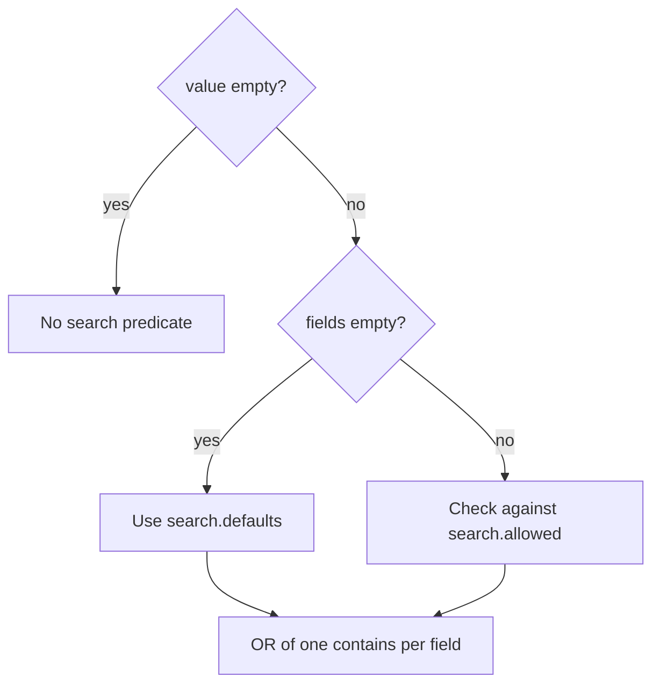

Search is one string matched against several field paths at once. It is the same `contains` compiler the filter tree uses, OR-ed across every searched field.

## The payload

`search` carries the text and the field list, and both are always present:

```ts twoslash
import type { QuerySearchRequest } from "drizzle-resource";
import { ordersResource, requestInput } from "./twoslash-support";

const search: QuerySearchRequest = { value: "laptop", fields: [] };

await ordersResource.query({
  context: { orgId: "acme" },
  request: { ...requestInput, search },
});
```

`fields: []` is the normal client behavior — the server decides what a search box covers.

## How the fields resolve

Two independent checks turn the payload into a predicate:



An empty `value` skips search entirely, whatever `fields` holds. A non-empty `value` with an empty `fields` array falls back to the resource's `search.defaults`, and an explicit field list is checked against `search.allowed`.

A field outside `allowed` throws:

```txt
Unknown search field "customer.orgId" for resource "orders"
```

Defaults never trigger that error. `defineResource` filters `search.defaults` down to `search.allowed` when it builds the resource, so the fallback list is always valid.

## Allowed versus defaults

`allowed` is the opt-in surface. `defaults` is what an empty field list resolves to:

```ts twoslash
import { engine } from "./engine";
// ---cut-before---
export const ordersResource = engine.defineResource("orders", {
  relations: { customer: true, orderLines: { with: { product: true } } },
  query: {
    search: {
      allowed: ["reference", "customer.name", "orderLines.product.name", "orderLines.product.sku"],
      defaults: ["reference", "customer.name"],
    },
  },
});
```

A client can now opt into SKU search by sending `fields: ["orderLines.product.sku"]`, while the plain search box stays on two cheap columns.

::warning
Omitting `search.allowed` makes **every registered field** searchable, and `search.defaults` then resolves to that same full list. A blank search box would OR a `contains` across every column of every declared relation. Always set `allowed` explicitly.
::

## The SQL it compiles

Each field becomes one `contains` condition, and the conditions are OR-ed together. Searching `laptop` across `reference` and `customer.name` produces:

```sql
select distinct orders.id from orders
inner join customers on orders.customerId = customers.id
where (
  lower(orders.reference) like '%laptop%'
  or lower(customers.name) like '%laptop%'
)
-- AND-ed with the scope filter and every client filter
```

There is no `ILIKE`. Text columns are wrapped in `lower(col)`, and non-text columns are wrapped in `lower(cast(col as text))`, so a search can reach `totalAmount` or `createdAt` as well as `reference`.

::note
The value is lowercased but **not trimmed**. A `value` of `"  "` is two characters long, so it compiles to `like '%  %'` and matches rows containing two spaces. Trim on the client or in your handler.
::

## Searching through a relation

A search field is resolved exactly like a filter key, so cardinality drives the cost.

A `one` path adds an `INNER JOIN` shared with the rest of the query. A `many` path compiles to a correlated `EXISTS` subquery, and each searched `many` path adds its own subquery to the same `OR`:

```sql
where (
  lower(orders.reference) like '%laptop%'
  or exists (
    select 1 from order_lines
    inner join products on order_lines.productId = products.id
    where orders.id = order_lines.orderId
      and lower(products.name) like '%laptop%'
  )
)
```

Postgres cannot short-circuit that `OR` with an index-only plan, which is why two root columns in `search.defaults` outperform six that reach through `many` relations.

## Indexing for leading wildcards

`%value%` has a leading wildcard, so a plain b-tree index on the column is unusable. Two things make search fast:

::steps

### Index the expression, not the column

The predicate is `lower(col)`, so the index must be too — `create index on orders (lower(reference))`. A b-tree on `reference` alone is never consulted.

### Add a trigram index for substring matching

A leading wildcard needs `pg_trgm`: `create extension pg_trgm` then `create index on orders using gin (lower(reference) gin_trgm_ops)`. A b-tree expression index only helps prefix matches.
::

Keep `search.defaults` to the fields you are willing to index. See [Optimization](/performance/optimization).

## Next steps

- [Filter Trees](/query-contract/filters) — the `contains` operator and the ten others
- [Field Paths](/core-concepts/field-paths) — how a path becomes searchable in the first place
- [Optimization](/performance/optimization) — the full indexing playbook
- [Relation Model](/core-concepts/relation-model) — what a `many` path costs
