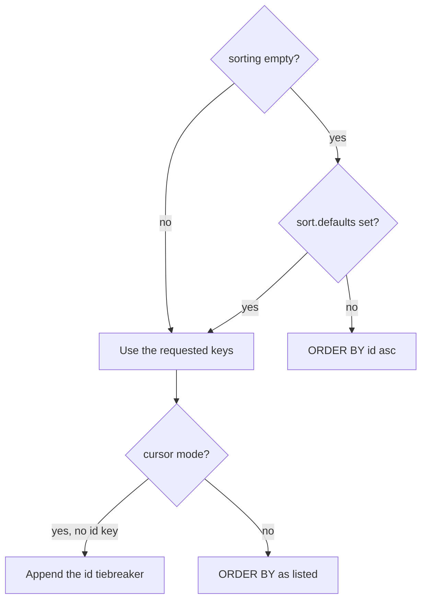

`sorting` is an ordered list of `{ key, dir }` descriptors. The engine applies them left to right and turns each one into a Drizzle `asc` or `desc` argument.

## Multi-column sort

Later descriptors break ties in earlier ones:

```ts twoslash
import type { QuerySortDescriptor } from "drizzle-resource";
import { ordersResource, requestInput, type MyFieldPaths } from "./twoslash-support";

const sorting: QuerySortDescriptor<MyFieldPaths>[] = [
  { key: "isPriority", dir: "desc" },
  { key: "createdAt", dir: "desc" },
];

await ordersResource.query({
  context: { orgId: "acme" },
  request: { ...requestInput, sorting },
});
```

Priority orders come first, and within each group the newest order leads.

## What ends up in ORDER BY

The request is only the first of three inputs:



Declare the fallback once on the resource:

```ts twoslash
import { engine } from "./engine";
// ---cut-before---
export const ordersResource = engine.defineResource("orders", {
  relations: { customer: true },
  query: {
    sort: { defaults: [{ key: "createdAt", dir: "desc" }] },
  },
});
```

Defaults are a **replacement**, not a merge — a client that sends one descriptor gets exactly that one, with no secondary sort added behind it.

Every descriptor in `sort.defaults` must itself be sortable. Building a validator schema over a resource whose default is not throws `Default sorting field "…" is not allowed for resource "orders"`.

With no `sorting` in the request and no `sort.defaults` on the resource, the ids query falls back to `ORDER BY id asc`. Result order is never left to the database.

## A non-sortable key throws

Two different errors guard the sort list, and neither one is a silent drop.

An unknown path throws first. The orders resource lists `deletedAt` in `filters.disabled`, which deletes it from the registry, so sorting on it fails:

```txt
Unknown sorting field "deletedAt" for resource "orders"
```

A registered but non-sortable path throws the second error:

```txt
Sorting field "tags.name" is not allowed for resource "orders"
```

::caution
`sort.disabled` does not drop a descriptor — the whole request fails. Filter the client's sort state against the resource's policy before you send it, or catch the error and map it to a 400. See [Error Handling](/integration/error-handling).
::

## Many-relation paths are structurally non-sortable

Sortability is derived, not configured. A registry entry is sortable only when its path crosses **no `many` step**, so `orderLines.*`, `orderLines.product.*`, and `tags.*` can never be sorted:

```ts twoslash
import { ordersResource, requestInput, utils, type MyFieldPaths } from "./twoslash-support";
// ---cut-before---
const requested: MyFieldPaths[] = ["customer.name", "tags.name"];

// Drop what the registry marks non-sortable before the engine throws
await ordersResource.query({
  context: { orgId: "acme" },
  request: {
    ...requestInput,
    sorting: requested
      .filter((key) => utils.resolveField(key)?.sortable)
      .map((key) => ({ key, dir: "asc" as const })),
  },
});
```

Only `customer.name` survives that filter. The reason is structural rather than budgetary — an order has many lines, so sorting orders by line quantity has no single value to sort on.

Listing a `many` path in `sort.disabled` is a no-op. It was already non-sortable, and `sort.disabled` only clears the flag on paths that had it.

::note
`sort.disabled` and `filters.disabled` are not symmetric. `sort.disabled` keeps the path in the registry and clears its `sortable` flag, so the field stays filterable, searchable, and facetable. `filters.disabled` deletes the path outright.
::

## Sorting through a one relation

A `one` path is sortable and adds an `INNER JOIN` to the ids query:

```sql
select distinct orders.id from orders
inner join customers on orders.customerId = customers.id
where ...
order by customers.name asc
```

The join is an inner join in every case. Sorting on a path through an **optional** `one` relation therefore hides rows with no related record — a behavior change, not just a cost.

## The cursor tiebreaker

Cursor mode needs a total order, so it appends `{ key: "id" }` when the effective sorting has no `id` descriptor. The appended direction mirrors the last descriptor:

| Requested sorting          | Effective sorting in cursor mode           |
| -------------------------- | ------------------------------------------ |
| `[{ createdAt, desc }]`    | `[{ createdAt, desc }, { id, desc }]`      |
| `[{ customer.name, asc }]` | `[{ customer.name, asc }, { id, asc }]`    |
| `[]` with no defaults      | `[{ id, asc }]`                            |
| `[{ id, asc }]`            | unchanged — an `id` key is already present |

Without that tiebreaker two orders sharing a `createdAt` could appear on two consecutive pages, or on neither. The appended descriptor is also part of the cursor payload, so it is what makes a cursor invalid after the sort changes — see [Pagination](/query-contract/pagination).

## Next steps

- [Pagination](/query-contract/pagination) — how sorting and cursors are bound together
- [Field Paths](/core-concepts/field-paths) — where the `sortable` flag comes from
- [Relation Model](/core-concepts/relation-model) — the full cardinality rules
- [Field Policy](/resource-setup/field-policy) — `hidden`, `disabled`, and what each one removes
