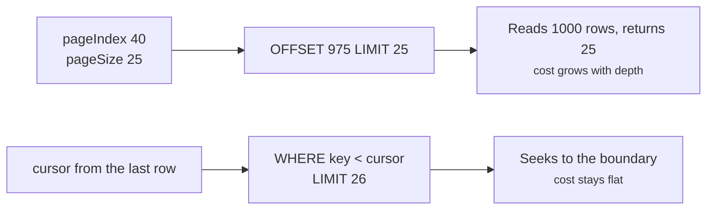

Pagination is a discriminated union on `mode`. Offset mode numbers pages; cursor mode remembers where the last page stopped.



Offset can jump to any page and report a page count. Cursor cannot do either, and in exchange page 40 costs what page 1 costs.

## Offset mode

`pageIndex` is one-based, and the engine converts it to `(pageIndex - 1) * pageSize`:

```ts twoslash
import { ordersResource, requestInput } from "./twoslash-support";
// ---cut-before---
const page = await ordersResource.query({
  context: { orgId: "acme" },
  request: { ...requestInput, pagination: { mode: "offset", pageIndex: 40, pageSize: 25 } },
});

if (page.pageInfo.mode === "offset") {
  page.pageInfo.hasNextPage;
}
```

`mode` may be omitted altogether — an input without it is read as offset. A `pageIndex` or `pageSize` of zero or less falls back to `defaults.pagination`, then to `1` and `25`.

## Cursor mode

Cursor mode is opt-in. Offset is the only mode a resource accepts until you list another:

```ts twoslash
import { engine } from "./engine";
// ---cut-before---
export const ordersResource = engine.defineResource("orders", {
  relations: { customer: true },
  query: {
    pagination: { modes: ["cursor", "offset"] },
    defaults: { pagination: { mode: "cursor", pageSize: 25 } },
    sort: { defaults: [{ key: "createdAt", dir: "desc" }] },
  },
});
```

A resource that never lists a mode rejects every request for it, with `Pagination mode "cursor" is not allowed for resource "orders"`.

Two structural requirements come with it. The resource must expose a visible, sortable root `id`, or `defineResource` throws immediately:

```txt
Cursor pagination requires a visible, sortable root "id" field
```

And the effective sorting gains an `id` tiebreaker when it does not already have one, which is what makes the ordering total — see [Sort Order](/query-contract/sorting).

The first page omits the cursor; every later page echoes back `nextCursor`:

```ts twoslash
import type { QueryRequestInput } from "drizzle-resource";
import { ordersResource, requestInput } from "./twoslash-support";

const first: QueryRequestInput = { ...requestInput, pagination: { mode: "cursor", pageSize: 25 } };
const firstPage = await ordersResource.query({ context: { orgId: "acme" }, request: first });

if (firstPage.pageInfo.mode === "cursor" && firstPage.pageInfo.nextCursor) {
  await ordersResource.query({
    context: { orgId: "acme" },
    request: {
      ...first,
      pagination: { mode: "cursor", cursor: firstPage.pageInfo.nextCursor, pageSize: 25 },
    },
  });
}
```

`nextCursor` is `null` on the last page, which is the only end-of-list signal cursor mode gives you — there is no `hasNextPage` on a cursor `pageInfo`.

The engine fetches `pageSize + 1` ids to decide that. The extra id never reaches `rows`; it only proves another page exists.

## The count policy

`count` is independent of `mode`, but the two defaults differ:

| Mode     | Default `count` | Why                                                      |
| -------- | --------------- | -------------------------------------------------------- |
| `offset` | `"exact"`       | A numbered pager needs a total to render                 |
| `cursor` | `"none"`        | Counting the whole set undoes the reason to use a cursor |

`count: "exact"` runs a `select count(*)` over the shared `matching_ids` CTE **before** the ids query. When that count is zero the ids query is skipped entirely.

Either mode accepts either policy. An offset-backed "load more" button can set `count: "none"`, and a cursor feed that needs a headline total can set `count: "exact"`:

```ts twoslash
import type { QueryPaginationInput } from "drizzle-resource";
// ---cut-before---
const loadMore: QueryPaginationInput = {
  mode: "offset",
  pageIndex: 2,
  pageSize: 25,
  count: "none",
};
const countedFeed: QueryPaginationInput = { mode: "cursor", pageSize: 25, count: "exact" };
```

With `count: "none"`, offset mode also switches to the lookahead row, so `hasNextPage` stays correct without a total.

## Narrowing pageInfo

`pageInfo` is a union on two axes. `mode` selects the navigation fields, and `count` selects whether `rowCount` is a number:

```ts twoslash
import type { QueryPageInfo } from "drizzle-resource";

declare const pageInfo: QueryPageInfo;

if (pageInfo.mode === "offset") {
  pageInfo.pageIndex;
  pageInfo.hasNextPage;
} else {
  pageInfo.nextCursor;
}

if (pageInfo.count === "exact") {
  const total: number = pageInfo.rowCount;
  total.toLocaleString();
}
```

`rowCount` is `null` on every response that did not ask for an exact count.

## When a cursor stops being valid

A cursor is base64url-encoded JSON, not a row offset. It carries the resource key, the full effective sorting, and the sort-column values of the last row on the page.

`decodeCursor` compares all three and throws `Invalid cursor` when any of them moved:

- The **resource** changed — a cursor from one resource cannot be replayed on another.
- The **sorting** changed — every key and direction must match, in order. Flipping `createdAt` from `desc` to `asc` invalidates it.
- The **payload** is malformed, truncated, or a different version.

::warning
Changing `filters`, `search`, or the caller's scope does **not** throw. The cursor still decodes, and the next page resumes from a position in a result set that no longer exists — silently skipping or repeating rows. Reset the cursor to `null` yourself whenever anything but the page position changes.
::

The payload is encoded, not signed. A client can read it, and tampering only moves the window inside a result set the scope filter has already narrowed.

Cursor length is capped at 2048 characters by `maxCursorLength`, which throws `Cursor cannot exceed 2048 characters`. The payload grows with the number of sort columns and the size of their values, so wide sort lists are the reason to care.

## Limits

`maxPageSize` defaults to 100 and applies to both modes, throwing `Page size cannot exceed 100`. Lower it per resource or per endpoint:

```ts twoslash
import { engine } from "./engine";
// ---cut-before---
export const ordersResource = engine.defineResource("orders", {
  query: {
    pagination: { modes: ["cursor", "offset"] },
    validation: { maxPageSize: 50, maxCursorLength: 1024 },
  },
});
```

Both ceilings are enforced by the engine itself, so a direct `resource.query(...)` call is bounded even with no validator in front of it. See [Request Limits](/resource-setup/limits).

## Next steps

- [Sort Order](/query-contract/sorting) — the tiebreaker that makes cursor traversal total
- [Infinite Lists](/integration/infinite-lists) — a complete cursor loop and when to reset it
- [Data Tables](/integration/data-tables) — driving a numbered pager from `pageInfo`
- [Execution Cost](/performance/execution-cost) — what the exact count actually costs
