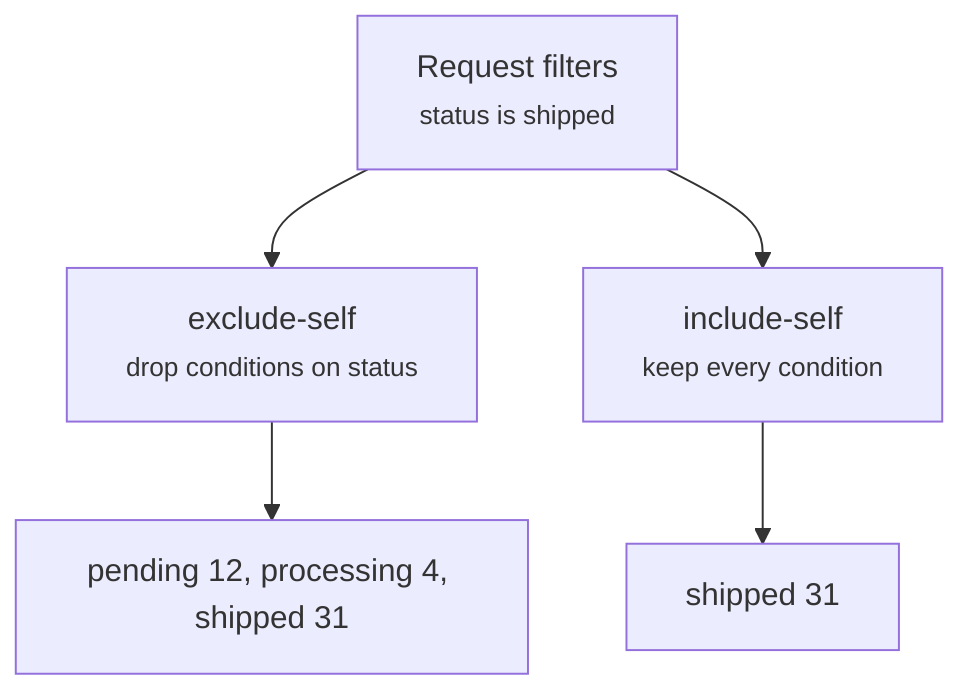

A facet is a grouped count over the rows the request already matches — the "pending 12, shipped 31" numbers a filter sidebar shows next to each option.

Facets travel in the same request as the page and resolve against the same filter universe.

## The facet request

Only `key` is required. Every other field narrows or paginates the bucket list:

::field-group
::field{name="key" type="string" required}
Field path to group by. It must appear in the resource's `facets.allowed` list.
::

::field{name="mode" type="exclude-self | include-self"}
Whether conditions on this same key stay applied while counting. Defaults to `exclude-self`.
::

::field{name="search" type="string"}
Free-text filter on the **bucket values**, not on the rows. Compiles to `lower(cast(value as text)) like '%search%'`.
::

::field{name="limit" type="number"}
Maximum buckets to return. Omitting it returns every bucket and leaves `nextCursor` undefined.
::

::field{name="cursor" type="string | null"}
Bucket-pagination cursor from a previous `nextCursor`. It is a numeric offset rendered as a string.
::
::

## Modes

`mode` decides whether a facet can still show the options a user has not selected:



`exclude-self` strips **every condition whose key equals the facet key**, at any depth of the tree, before computing buckets. That is what keeps the other statuses visible and clickable after a user selects one.

`include-self` keeps the whole tree. Use it for drill-down counts, where the facet describes the current selection rather than the alternatives to it.

`exclude-self` is the default, applied when `mode` is absent.

::caution
`exclude-self` strips conditions by key alone, and the scope filter has already been merged into the same tree. A facet on a path your `scope` filters on therefore **removes the tenant condition** and counts across every tenant. Keep every scoped path out of `facets.allowed`, and never omit `facets.allowed` on a scoped resource — an absent list makes every registered field facetable.
::

## Requesting facets

Pass them inside the request to resolve buckets and rows together:

```ts twoslash
import type { QueryFacetRequest } from "drizzle-resource";
import { ordersResource, requestInput, type MyFieldPaths } from "./twoslash-support";

const facets: QueryFacetRequest<MyFieldPaths>[] = [
  { key: "status", mode: "exclude-self", limit: 10 },
  { key: "orderLines.product.category", mode: "exclude-self", limit: 20 },
];

const page = await ordersResource.query({
  context: { orgId: "acme" },
  request: { ...requestInput, facets },
});

page.facets?.map((facet) => facet.key);
```

`facets` is undefined on the response when the request asked for none.

Use `queryFacets` when the sidebar refreshes on its own, without re-running the ids and rows stages:

```ts twoslash
import { ordersResource, requestInput } from "./twoslash-support";
// ---cut-before---
const response = await ordersResource.queryFacets({
  context: { orgId: "acme" },
  request: requestInput,
  facets: [{ key: "status", mode: "exclude-self", limit: 10 }],
});

for (const facet of response.facets) {
  facet.options.map((option) => `${String(option.value)} (${option.count})`);
}
```

`queryFacets` takes its facets as a sibling argument, not from `request.facets`.

## The SQL it runs

One query per facet, and the total comes back inside it. There is no second count query:

```sql
with facet_matching_ids as (
  select distinct orders.id from orders
  inner join customers on orders.customerId = customers.id
  where <scope and filters, minus conditions on status when exclude-self>
),
facet_buckets as (
  select orders.status as value, count(distinct facet_matching_ids.id) as count
  from orders
  inner join facet_matching_ids on facet_matching_ids.id = orders.id
  group by orders.status
)
select value, count, count(*) over () as total
from facet_buckets
order by count desc, value asc
limit 10
```

`count(distinct …)` is used for every field type, not only for relation paths. `count(*) over ()` is a window function evaluated over the unlimited bucket list, which is how `total` survives `limit`.

Facets that resolve to the **same** filter tree share one `facet_matching_ids` CTE. Every `include-self` facet lands in that group, as does an `exclude-self` facet on a key nothing is filtering. Only an `exclude-self` key that really strips a condition needs a CTE of its own — see [Execution Cost](/performance/execution-cost).

A path whose first step is a `many` relation is grouped from the other side, starting at the CTE and joining the relation chain outward:

```sql
select products.category as value, count(distinct facet_matching_ids.id) as count
from facet_matching_ids
inner join order_lines on facet_matching_ids.id = order_lines.orderId
inner join products on order_lines.productId = products.id
group by products.category
```

`count(distinct …)` is what keeps an order with four electronics lines counted once.

## Ordering, nulls, and the response

Buckets come back ordered by `count desc, value asc`, so ties break alphabetically rather than arbitrarily.

Each result echoes its key and carries the buckets alongside the two pagination fields:

::field-group
::field{name="key" type="string" required}
Echoes the requested field path.
::

::field{name="options" type="QueryFacetOption[]" required}
The buckets for this page — each one a `value` and a `count`, already ordered and already stripped of nulls.
::

::field{name="total" type="number"}
Bucket count before `limit` and `cursor` are applied. Use it for "showing 10 of 47".
::

::field{name="nextCursor" type="string | null"}
Offset of the next bucket page, or `null` at the end. Undefined when the request set no `limit`.
::
::

::note
Null buckets are dropped from `options` **after** the limit is applied, and `total` still counts them. A facet on a nullable column can therefore return nine options for `limit: 10` and report a `total` one higher than the number of real values.
::

## Bucket search and bucket pagination

A facet on `customer.name` can have thousands of buckets. Two fields make that list navigable without touching the row query.

`search` filters bucket values before grouping is counted, matching the same way `contains` does:

```ts twoslash
import { ordersResource, requestInput } from "./twoslash-support";
// ---cut-before---
const typeahead = await ordersResource.queryFacets({
  context: { orgId: "acme" },
  request: requestInput,
  facets: [{ key: "customer.name", search: "acm", limit: 20 }],
});

typeahead.facets[0]?.options.length;
```

`cursor` walks the rest. Feed the previous `nextCursor` straight back, and stop when it comes back `null`:

```ts twoslash
import { ordersResource, requestInput } from "./twoslash-support";
// ---cut-before---
const firstPage = await ordersResource.queryFacets({
  context: { orgId: "acme" },
  request: requestInput,
  facets: [{ key: "customer.name", limit: 20 }],
});

const cursor = firstPage.facets[0]?.nextCursor;
if (cursor) {
  await ordersResource.queryFacets({
    context: { orgId: "acme" },
    request: requestInput,
    facets: [{ key: "customer.name", limit: 20, cursor }],
  });
}
```

`nextCursor` is only produced when `limit` is set — without a limit there is nothing left to page through.

## Limits

Two ceilings apply to facets, and the engine enforces both:

| Limit           | Default | Error                                          |
| --------------- | ------- | ---------------------------------------------- |
| `maxFacetCount` | 10      | `A request cannot contain more than 10 facets` |
| `maxFacetLimit` | 50      | `Facet limit cannot exceed 50`                 |

Both ceilings are checked against `request.facets`. A list handed to `queryFacets` as the sibling argument is checked for field access but not for size, so bound it yourself when it comes from a client.

A facet key outside `facets.allowed` throws `Unknown facet field "…" for resource "orders"` before any SQL runs.

## Next steps

- [Filter Trees](/query-contract/filters) — the tree `exclude-self` rewrites
- [Data Tables](/integration/data-tables) — turning buckets into a filter sidebar
- [Execution Cost](/performance/execution-cost) — the shared CTE and what each facet adds
- [Scope Rules](/resource-setup/scope) — why a scoped path must never be facetable
