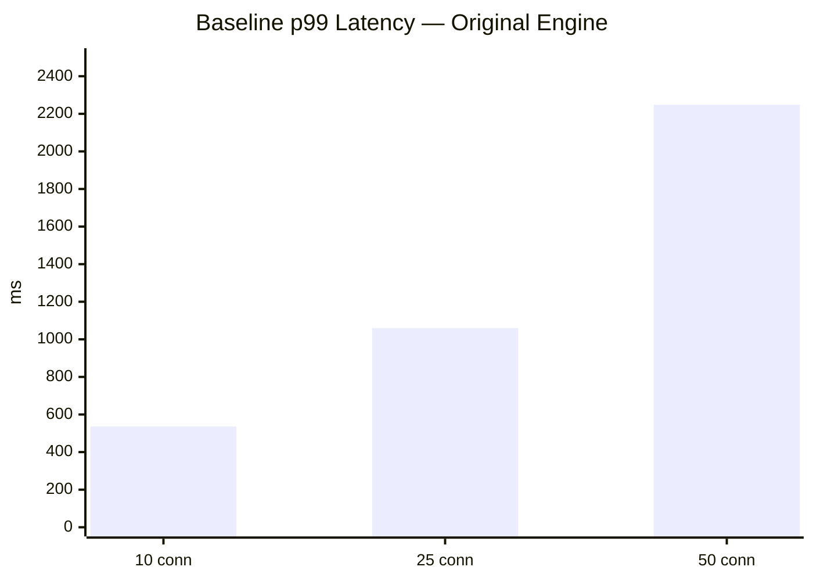

# Benchmark Results

These are real measurements from a benchmark suite run against an orders/HR-style dataset with ~100k rows, multiple relations, and several facet types. The benchmarks cover four progressive optimization stages.

The scenarios used:

| Scenario                 | What it tests                                   |
| ------------------------ | ----------------------------------------------- |
| `baseline-no-facets`     | Pure page query, no facets                      |
| `two-cheap-facets`       | Two direct-relation facets                      |
| `m2m-skill-facet`        | One many-to-many facet through a junction table |
| `filtered-mixed-facets`  | Active filters + multiple facets                |
| `facet-self-inclusion`   | Facet with `include-self` mode                  |
| `deep-page-mixed-facets` | Page 100+ with mixed facets                     |

Benchmarks were run at 10, 25, and 50 concurrent connections, with a 3-second warmup and 10-second measurement window per run.

---

## Stage 1 — Baseline: original automatic engine

Starting point — automatic pipeline, no custom indexes, default connection pool.

The baseline query (no facets) was already slow. The root cause: without indexes on join columns and sorted fields, each request scanned full tables.

### Baseline p99 latency (no facets)

| Concurrency |  RPS |     p99 |
| ----------- | ---: | ------: |
| 10 conn     | 29.4 |   536ms |
| 25 conn     | 29.8 | 1,060ms |
| 50 conn     | 28.4 | 2,248ms |

Facet-heavy scenarios ranged from 1,500ms to 9,900ms p99 — usable only at low concurrency.

---

## Stage 2 — Indexes + explicit connection pooling

Added indexes on all hot-path columns (foreign keys, sort columns, filter columns) and configured an explicit connection pool with statement timeouts.

### Impact on the baseline query

```mermaid
xychart-beta
    title "Baseline p99 — Before vs After Indexes"
    x-axis ["10 conn", "25 conn", "50 conn"]
    y-axis "ms" 0 --> 2500
    bar [536, 1060, 2248]
    bar [81, 180, 292]
```

| Concurrency | Before RPS | After RPS | Before p99 | After p99 |
| ----------- | ---------: | --------: | ---------: | --------: |
| 10 conn     |       29.4 |     259.5 |      536ms |      81ms |
| 25 conn     |       29.8 |     237.6 |    1,060ms |     180ms |
| 50 conn     |       28.4 |     231.8 |    2,248ms |     292ms |

**The baseline improved by ~8× in throughput and ~87% in p99 latency.** Indexes on the join and sort columns were the dominant factor.

### What happened to facet-heavy scenarios

Counterintuitively, most facet scenarios got _worse_ after indexing:

| Scenario                   | 10 conn before | 10 conn after |
| -------------------------- | -------------: | ------------: |
| Two cheap facets p99       |        1,526ms |       2,213ms |
| m2m skill facet p99        |        2,051ms |       2,907ms |
| Deep page mixed facets p99 |        3,245ms |       5,078ms |

Why? Once the cheap baseline path became fast, more requests reached the database concurrently. Facet aggregation queries, which are inherently more expensive, now hit the database at higher volume. The explicit pool (max=15) let more concurrent facet queries run simultaneously, exposing the facet engine as the next bottleneck.

**The lesson:** indexing fixed the cheap path and revealed the expensive one. This is normal — it means the indexes worked.

---

## Stage 3 — Engine optimization: shared filter universe for facets

The engine was refactored to share the filtered row universe across all facets in a single request, reducing per-facet queries from ~2 to ~1.

```mermaid
xychart-beta
    title "m2m Skill Facet p99 Across Stages"
    x-axis ["10 conn", "25 conn", "50 conn"]
    y-axis "ms" 0 --> 8000
    bar [2051, 3461, 7408]
    bar [2907, 7026, 9807]
    bar [2613, 7073, 0]
```

`0` = fully timed out (no p99 produced).

The engine optimization helped at low concurrency (m2m p99 dropped from 2,907ms → 2,613ms at 10 conn). At 25–50 connections, the fundamental cost of grouped bucket aggregation remained the dominant problem. The engine change was directionally correct but not sufficient for high-concurrency heavy faceting.

**The lesson:** reducing per-facet round trips helps, but the root cost is the aggregation itself. At high concurrency with m2m facets, you need either a specialized strategy or a different data model.

---

## Stage 4 — Manual `strategy.ids`

Replacing the automatic ids query with a hand-written SQL query tailored to the resource's join shape.

### Baseline: automatic vs manual ids

```mermaid
xychart-beta
    title "Baseline p99 — Auto vs Manual strategy.ids"
    x-axis ["10 conn", "25 conn", "50 conn"]
    y-axis "ms" 0 --> 5000
    bar [928, 2136, 4504]
    bar [92, 183, 409]
```

| Concurrency | Auto RPS | Manual RPS | Auto p99 | Manual p99 |
| ----------- | -------: | ---------: | -------: | ---------: |
| 10 conn     |     17.2 |      219.7 |    928ms |       92ms |
| 25 conn     |     15.1 |      229.6 |  2,136ms |      183ms |
| 50 conn     |     14.1 |      240.9 |  4,504ms |      409ms |

**The manual ids strategy is ~12.7× faster in throughput and reduces p99 latency by ~90%.** The automatic ids path carries overhead from its general-purpose CTE approach that a hand-tuned query avoids.

### Facet scenarios: auto vs manual

```mermaid
xychart-beta
    title "m2m Skill Facet p99 — Auto vs Manual"
    x-axis ["10 conn", "25 conn", "50 conn"]
    y-axis "ms" 0 --> 10000
    bar [2516, 6427, 0]
    bar [2124, 3535, 9319]
```

The manual ids strategy also improves facet-heavy scenarios, but the m2m facet path remains expensive (3,535ms at 25 conn). The facet cost is inherent to the aggregation — it cannot be eliminated by a faster ids query alone.

### All scenarios: 10 connections

| Scenario               | Auto RPS | Manual RPS | Auto p99 | Manual p99 |
| ---------------------- | -------: | ---------: | -------: | ---------: |
| baseline-no-facets     |     17.2 |      219.7 |    928ms |       92ms |
| two-cheap-facets       |      6.4 |       10.8 |  1,788ms |    1,301ms |
| m2m-skill-facet        |      5.2 |        8.2 |  2,516ms |    2,124ms |
| filtered-mixed-facets  |      8.1 |        9.9 |  1,616ms |    1,441ms |
| facet-self-inclusion   |     17.4 |       27.5 |    773ms |      475ms |
| deep-page-mixed-facets |      3.0 |        4.8 |  3,986ms |    2,644ms |

---

## Summary: what each optimization stage buys you

| Optimization                        | Impact                                | Effort                                        |
| ----------------------------------- | ------------------------------------- | --------------------------------------------- |
| Database indexes                    | ~8× baseline throughput               | Low — add indexes to FK and sort columns      |
| Explicit connection pool + timeouts | Stability + prevents runaway queries  | Low — configuration only                      |
| `strategy.ids` (manual)             | ~12× baseline throughput vs automatic | Medium — write tailored SQL for each resource |
| `strategy.facets` (manual)          | Varies — mostly for m2m paths         | High — specialized aggregation logic          |

Start with indexes. Add `strategy.ids` only when you have benchmark data showing the automatic path is the bottleneck. Do not skip the benchmark step.
