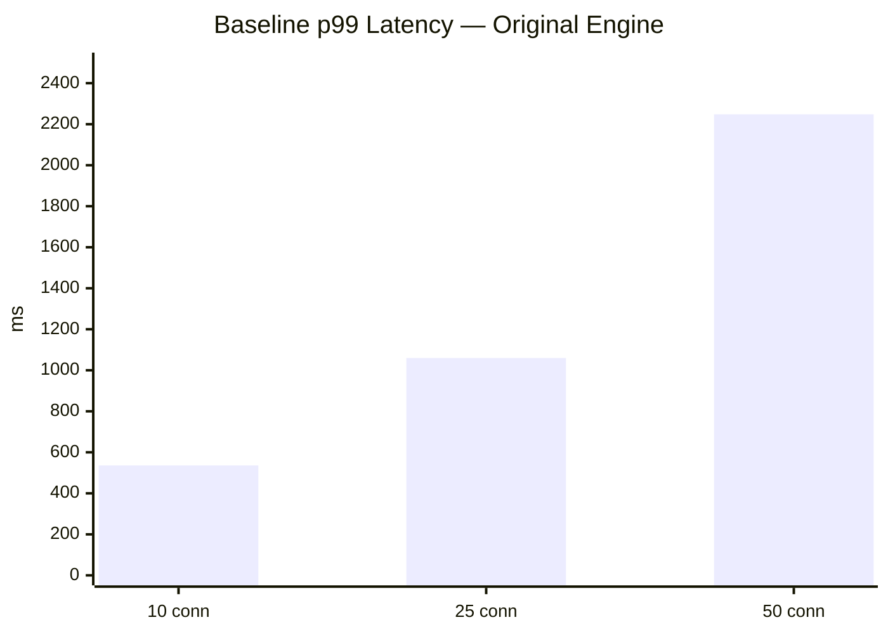

## PostgreSQL engine comparison: 200,000 rows

`tools/benchmark-postgres.ts` compares a baseline package with the current source against the same isolated PostgreSQL schema. It creates 200,000 consumption rows and 20,000 accounts with primary, join, and sort indexes; checks result equivalence; then alternates execution order across ten measured iterations after warm-up. It drops only its uniquely named schema afterward.

The September 21, 2026 local run used PostgreSQL 18, 4 MB `work_mem`, and a pool capped at ten connections. This is a single-client engine comparison, not an HTTP concurrency or production-capacity claim. Facet responses are compared by key because older versions could reorder facets when grouping their filter universes.

| Operation                        | 2.4.1 median | Optimized median | SQL statements before / after |
| -------------------------------- | -----------: | ---------------: | ----------------------------: |
| Page without count               |     38.59 ms |          0.67 ms |                         1 / 1 |
| Page with exact count            |     48.48 ms |          5.02 ms |                         2 / 2 |
| Relation search with exact count |    167.35 ms |         43.38 ms |                         2 / 2 |
| Three root facets                |     84.85 ms |         24.57 ms |                         3 / 1 |
| Five root/relation facets        |    194.66 ms |         56.53 ms |                         5 / 2 |
| Filtered exclude-self facets     |    127.51 ms |         35.12 ms |                         5 / 3 |

The engine removes redundant root scans and deduplication where schema constraints prove uniqueness. Compatible facets use PostgreSQL `GROUPING SETS`; no pool enlargement, server-memory tuning, approximate count, result cache, or search-semantic change is involved. Measure CPU time per completed request and peak memory under your own concurrent workload before sizing production services.

Run `bun run benchmark:postgres` with `TEST_DATABASE_URL` pointing to an isolated local database and `BENCH_BASELINE_MODULE` pointing to the `build/index.js` of an installed `drizzle-resource@2.4.1`. `BENCH_ROWS` and `BENCH_ITERATIONS` override the defaults. JSON results go to standard output; progress goes to standard error.

## Incremental scan, aggregate, and search improvements

A second September 21 run compares the preceding optimization pass (`ab04689`) with the scoped-scan and cost-guided search implementation (`bf26da7`). Both variants use the same 200,000-row schema, 20,000 accounts, PostgreSQL 18.4, 4 MB `work_mem`, and matching `lower(column)` trigram indexes. These gains are incremental to the first table, not comparisons with published 2.4.1. Raw samples are in `tools/results/postgres-scans-2026-09-21.json`.

| Operation                                           | Previous median | New median |                           Change |
| --------------------------------------------------- | --------------: | ---------: | -------------------------------: |
| Page, exact count, three root facets                |        31.75 ms |   28.08 ms | 12% less time; 4 to 3 statements |
| Selective cross-table reference search, exact count |        85.14 ms |    6.32 ms |                13.5 times faster |
| Selective cross-table account search, exact count   |        87.04 ms |    4.14 ms |                  21 times faster |
| Broad cross-table reference search, exact count     |        21.52 ms |   22.82 ms |                   1.30 ms slower |
| Broad cross-table reference search, no count        |         0.79 ms |    1.77 ms |                   0.98 ms slower |
| Full 200,000-row traversal, date sort               |         1.674 s |    1.043 s |                    38% less time |
| Full 200,000-row traversal, account-name sort       |         4.036 s |    1.184 s |                    71% less time |

Query medians use ten alternating samples after warm-up. Traversal medians use three full passes per variant with alternating order. The preceding and current ordinary-pagination variants both use keyset pagination with 1,000-row batches, an exact count on the first page only, and a repeatable-read transaction. The scan also requests an exact count. Every pass hashes every hydrated row in sequence and checks identical hashes, row counts, and a maximum batch of 1,000; it does not retain the complete result in JavaScript.

The scan issues 405 statements versus 403 for ordinary pagination, because cursor declaration, fetches, and cleanup still require round trips. Its gain comes from keeping the selection execution open instead of rerunning it 200 times. Median benchmark-client CPU for account-name traversal fell from 1.159 CPU-seconds to 0.720 CPU-seconds, about 38%; date-sort CPU was essentially unchanged at 0.736 versus 0.734 CPU-seconds. This includes the benchmark's serialization and hashing, excludes PostgreSQL CPU, and is not an API-process measurement.

Search capability detection alone was insufficient: always rewriting broad terms caused substantial regressions during development. The final implementation adds two non-executing PostgreSQL plan estimates for eligible cross-table searches and retains the ordinary plan when it is estimated cheaper. The selective-search figures include that overhead. Broad searches can still pay roughly 1–3 ms for planning without gaining execution speed; this is an explicit trade-off, not a universal search speedup. Sort-only count changes and unchanged facet paths did not show a material gain in this fixture.

These are local engine measurements, not Excel generation, file upload, browser download, concurrent-memory, or production-capacity results. The new scan must be adopted by the export runtime before measuring end-to-end export time. Application batching is bounded, but database sorts and exact window counts can still use temporary storage, and every scan holds a connection and snapshot until its consumer finishes.

To reproduce the traversal comparison, add `BENCH_SCAN=1`, optionally set `BENCH_SCAN_ITERATIONS`, and point `BENCH_BASELINE_MODULE` at the preceding build. `BENCH_BASELINE_LABEL` records its revision; `BENCH_OUTPUT` writes the JSON artifact. `BENCH_SCENARIO` limits query scenarios by a name substring. The harness creates `pg_trgm` if absent in the isolated benchmark database, then creates its own schema and indexes. It removes its schema afterward but leaves the extension installed.

### Wide mixed-field search

A separate ten-sample run searched all nine fixture fields together: consumption ID, account ID, year, month, billed, reference, related account ID, account name, and account type. Each request hydrates a 50-row page where enough matches exist. This includes substring casts of numeric and boolean values, so it is not eligible for the all-indexed-text search rewrite. Both builds use the same fixture and indexes; raw samples are in `tools/results/postgres-wide-search-2026-09-21.json`.

| Term                | Page without count | Page with exact count | Exact count and five facets |
| ------------------- | -----------------: | --------------------: | --------------------------: |
| Selective `19999`   |             369 ms |                504 ms |                      512 ms |
| Broad `account`     |             2.6 ms |                 90 ms |                      242 ms |
| No match `not-here` |             108 ms |                191 ms |                      150 ms |

These are current-build medians. A broad no-count search can stop as soon as it finds the first page, while a rare or absent term can inspect the whole selection. Count and facet plans may choose different PostgreSQL execution paths, so adding facets does not imply a strictly increasing latency for every term.

The new pass does not materially accelerate the wide substring predicate itself. Sharing count/facet aggregation reduced the selective faceted request from 687 to 512 ms, the broad request from 340 to 242 ms, and the no-match request from 437 to 150 ms. Do not apply the two-field indexed-search speedup to arbitrary mixed-field searches. These single-client timings exclude HTTP/network/browser overhead and do not establish latency under concurrent traffic.

## Historical optimization stages

The following measurements predate the current automatic PostgreSQL optimizations. They came from an orders/HR-style dataset with approximately 100,000 rows, multiple relations, and several facet types; they illustrate tuning order rather than current-version capacity.

The scenarios used:

| Scenario                 | What it tests                                   |
| ------------------------ | ----------------------------------------------- |
| `baseline-no-facets`     | Pure page query, no facets                      |
| `two-cheap-facets`       | Two direct-relation facets                      |
| `m2m-skill-facet`        | One many-to-many facet through a junction table |
| `filtered-mixed-facets`  | Active filters + multiple facets                |
| `facet-self-inclusion`   | Facet with `include-self` mode                  |
| `deep-page-mixed-facets` | Page 100+ with mixed facets                     |

Benchmarks were run at 10, 25, and 50 concurrent connections, with a 3-second warmup and 10-second measurement window per run.

---

## Stage 1 — Baseline: original automatic engine

Starting point — automatic pipeline, no custom indexes, default connection pool.

The baseline query (no facets) was already slow. The root cause: without indexes on join columns and sorted fields, each request scanned full tables.

### Baseline p99 latency (no facets)

```mermaid
xychart-beta
    title "Baseline p99 Latency — Original Engine"
    x-axis ["10 conn", "25 conn", "50 conn"]
    y-axis "ms" 0 --> 2500
    bar [536, 1060, 2248]
```

| Concurrency |  RPS |     p99 |
| ----------- | ---: | ------: |
| 10 conn     | 29.4 |   536ms |
| 25 conn     | 29.8 | 1,060ms |
| 50 conn     | 28.4 | 2,248ms |

Facet-heavy scenarios ranged from 1,500ms to 9,900ms p99 — usable only at low concurrency.

---

## Stage 2 — Indexes + explicit connection pooling

Added indexes on all hot-path columns (foreign keys, sort columns, filter columns) and configured an explicit connection pool with statement timeouts.

### Impact on the baseline query

```mermaid
xychart-beta
    title "Baseline p99 — Before vs After Indexes"
    x-axis ["10 conn", "25 conn", "50 conn"]
    y-axis "ms" 0 --> 2500
    bar [536, 1060, 2248]
    bar [81, 180, 292]
```

| Concurrency | Before RPS | After RPS | Before p99 | After p99 |
| ----------- | ---------: | --------: | ---------: | --------: |
| 10 conn     |       29.4 |     259.5 |      536ms |      81ms |
| 25 conn     |       29.8 |     237.6 |    1,060ms |     180ms |
| 50 conn     |       28.4 |     231.8 |    2,248ms |     292ms |

**The baseline improved by ~8× in throughput and ~87% in p99 latency.** Indexes on the join and sort columns were the dominant factor.

### What happened to facet-heavy scenarios

Counterintuitively, most facet scenarios got _worse_ after indexing:

| Scenario                   | 10 conn before | 10 conn after |
| -------------------------- | -------------: | ------------: |
| Two cheap facets p99       |        1,526ms |       2,213ms |
| m2m skill facet p99        |        2,051ms |       2,907ms |
| Deep page mixed facets p99 |        3,245ms |       5,078ms |

Why? Once the cheap baseline path became fast, more requests reached the database concurrently. Facet aggregation queries, which are inherently more expensive, now hit the database at higher volume. The explicit pool (max=15) let more concurrent facet queries run simultaneously, exposing the facet engine as the next bottleneck.

**The lesson:** indexing fixed the cheap path and revealed the expensive one. This is normal — it means the indexes worked.

---

## Stage 3 — Engine optimization: shared filter universe for facets

The engine was refactored to share the filtered row universe across all facets in a single request, reducing per-facet queries from ~2 to ~1.

```mermaid
xychart-beta
    title "m2m Skill Facet p99 Across Stages"
    x-axis ["10 conn", "25 conn", "50 conn"]
    y-axis "ms" 0 --> 8000
    bar [2051, 3461, 7408]
    bar [2907, 7026, 9807]
    bar [2613, 7073, 0]
```

`0` = fully timed out (no p99 produced).

The engine optimization helped at low concurrency (m2m p99 dropped from 2,907ms → 2,613ms at 10 conn). At 25–50 connections, the fundamental cost of grouped bucket aggregation remained the dominant problem. The engine change was directionally correct but not sufficient for high-concurrency heavy faceting.

**The lesson:** reducing per-facet round trips helps, but the root cost is the aggregation itself. At high concurrency with m2m facets, you need either a specialized strategy or a different data model.

---

## Stage 4 — Manual `strategy.ids`

Replacing the automatic ids query with a hand-written SQL query tailored to the resource's join shape.

### Baseline: automatic vs manual ids

```mermaid
xychart-beta
    title "Baseline p99 — Auto vs Manual strategy.ids"
    x-axis ["10 conn", "25 conn", "50 conn"]
    y-axis "ms" 0 --> 5000
    bar [928, 2136, 4504]
    bar [92, 183, 409]
```

| Concurrency | Auto RPS | Manual RPS | Auto p99 | Manual p99 |
| ----------- | -------: | ---------: | -------: | ---------: |
| 10 conn     |     17.2 |      219.7 |    928ms |       92ms |
| 25 conn     |     15.1 |      229.6 |  2,136ms |      183ms |
| 50 conn     |     14.1 |      240.9 |  4,504ms |      409ms |

**The manual ids strategy is ~12.7× faster in throughput and reduces p99 latency by ~90%.** The automatic ids path carries overhead from its general-purpose CTE approach that a hand-tuned query avoids.

### Facet scenarios: auto vs manual

```mermaid
xychart-beta
    title "m2m Skill Facet p99 — Auto vs Manual"
    x-axis ["10 conn", "25 conn", "50 conn"]
    y-axis "ms" 0 --> 10000
    bar [2516, 6427, 0]
    bar [2124, 3535, 9319]
```

The manual ids strategy also improves facet-heavy scenarios, but the m2m facet path remains expensive (3,535ms at 25 conn). The facet cost is inherent to the aggregation — it cannot be eliminated by a faster ids query alone.

### All scenarios: 10 connections

| Scenario               | Auto RPS | Manual RPS | Auto p99 | Manual p99 |
| ---------------------- | -------: | ---------: | -------: | ---------: |
| baseline-no-facets     |     17.2 |      219.7 |    928ms |       92ms |
| two-cheap-facets       |      6.4 |       10.8 |  1,788ms |    1,301ms |
| m2m-skill-facet        |      5.2 |        8.2 |  2,516ms |    2,124ms |
| filtered-mixed-facets  |      8.1 |        9.9 |  1,616ms |    1,441ms |
| facet-self-inclusion   |     17.4 |       27.5 |    773ms |      475ms |
| deep-page-mixed-facets |      3.0 |        4.8 |  3,986ms |    2,644ms |

---

## Summary: what each optimization stage buys you

| Optimization                        | Impact                                | Effort                                        |
| ----------------------------------- | ------------------------------------- | --------------------------------------------- |
| Database indexes                    | ~8× baseline throughput               | Low — add indexes to FK and sort columns      |
| Explicit connection pool + timeouts | Stability + prevents runaway queries  | Low — configuration only                      |
| `strategy.ids` (manual)             | ~12× baseline throughput vs automatic | Medium — write tailored SQL for each resource |
| `strategy.facets` (manual)          | Varies — mostly for m2m paths         | High — specialized aggregation logic          |

Start with indexes. Add `strategy.ids` only when you have benchmark data showing the automatic path is the bottleneck. Do not skip the benchmark step.
