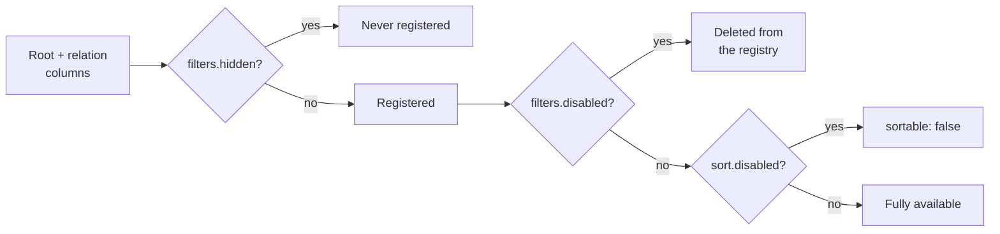

Field policy decides what each registered field path can do. It is enforced against the **field registry**, the map a resource builds from its schema and relation tree at definition time.

Two settings delete a path from that registry. The rest only narrow what a client may ask for.

## How the registry is filtered



`hidden` is checked while columns are registered, `disabled` deletes after registration. The end state is identical — the path is gone.

## The four axes

| Axis      | Keys                                 | Effect on a path                                         |
| --------- | ------------------------------------ | -------------------------------------------------------- |
| Existence | `filters.hidden`, `filters.disabled` | Removes the path from the registry — unusable everywhere |
| Search    | `search.allowed`, `search.defaults`  | Narrows which paths a client may search                  |
| Sort      | `sort.disabled`                      | Marks the path non-sortable; sorting on it throws        |
| Facet     | `facets.allowed`                     | Narrows which paths a client may request as a facet      |

There is no resource-level allow-list for filters. Resource policy either keeps a path filterable or removes it entirely; narrowing filters per endpoint is the validator's job, through [`requestSchema`](/integration/validation).

## Removing a path

Use `filters.hidden` or `filters.disabled` to take a path out of the registry:

```ts twoslash
import type { ExampleFiltersConfig } from "./twoslash-support";
// ---cut-before---
const filters = {
  hidden: ["customerId"],
  disabled: ["deletedAt"],
} satisfies ExampleFiltersConfig;
```

Both keys produce the same outcome — the path cannot be filtered, searched, sorted, faceted, or referenced by a scope function or a strategy.

::warning
`filters.disabled` is not a filter-only restriction. It deletes the field from the registry exactly as `hidden` does, so a `disabled` path is **not** still available to `query.scope` or to `strategy` code that calls `utils.resolveField`.
::

The registry is the source of truth, so check it rather than the config:

```ts twoslash
import { ordersResource } from "./twoslash-support";
// ---cut-before---
// `deletedAt` sits in `filters.disabled` — the path no longer exists
const registered: boolean = ordersResource.fields.has("deletedAt");
const resolved = ordersResource.fields.get("deletedAt");
```

`has` returns `false` and `get` returns `undefined` for either setting, which is the whole difference from a narrowing key.

::note
`queryConfig.filters.hidden` and `queryConfig.filters.disabled` are always empty at runtime. Both sets are built by intersecting your config with the registry, and the listed paths have already been removed from it.
::

Pick between the two on intent alone. `hidden` reads as "this column is not part of the public model"; `disabled` reads as "this column exists but the client has no business filtering on it".

## Narrowing search

`search.allowed` is the full set of searchable paths, and `search.defaults` is what runs when the client sends `search.fields: []`:

```ts twoslash
import type { ExampleSearchConfig } from "./twoslash-support";
// ---cut-before---
const search = {
  allowed: ["reference", "customer.name", "orderLines.product.name", "orderLines.product.sku"],
  defaults: ["reference", "customer.name"],
} satisfies ExampleSearchConfig;
```

A search field outside `allowed` throws `Unknown search field "totalAmount" for resource "orders"`.

Omit `allowed` and every registered path becomes searchable — including `id`, foreign keys, and timestamps. Set it explicitly on any resource a client can reach.

`defaults` is intersected with `allowed` when the resource is built. A default that is not allowed is dropped silently, which produces a resource whose empty-field search matches nothing.

## Narrowing facets

`facets.allowed` works the same way, and defaults to every registered path when omitted:

```ts twoslash
import type { ExampleFacetsConfig } from "./twoslash-support";
// ---cut-before---
const facets = {
  allowed: ["status", "customer.billingCountry", "orderLines.product.category", "tags.name"],
} satisfies ExampleFacetsConfig;
```

A facet request for any other key throws `Unknown facet field "reference" for resource "orders"`. Keep the list short — each facet adds a grouped aggregate to the request, and [Execution Cost](/performance/execution-cost) shows what that costs.

## Disabling a sort key

`sort.disabled` keeps the path in the registry and flips its `sortable` flag:

```ts twoslash
import type { ExampleSortConfig } from "./twoslash-support";
// ---cut-before---
const sort = {
  defaults: [{ key: "createdAt", dir: "desc" }],
  disabled: ["customer.billingCountry"],
} satisfies ExampleSortConfig;
```

A request that sorts on a disabled key throws `Sorting field "customer.billingCountry" is not allowed for resource "orders"`.

::caution
A disabled sort key is **not** silently dropped. The whole request fails, so a client that sends a stale column name gets an error rather than a differently ordered page.
::

Because the path stays registered, it remains filterable, searchable, and available to `query.scope` — `sort.disabled` is the one policy key that restricts without removing.

## Paths that are never sortable

A path that crosses a `many` relation step has no single value per root row, so the registry marks it non-sortable when it is built:

```ts twoslash
import { ordersResource } from "./twoslash-support";
// ---cut-before---
const rootColumn = ordersResource.fields.get("createdAt")?.sortable; // true
const throughOne = ordersResource.fields.get("customer.name")?.sortable; // true
const throughMany = ordersResource.fields.get("tags.name")?.sortable; // false
```

Listing `tags.name` in `sort.disabled` is a no-op — it is already unsortable, and sorting on it throws the same `is not allowed` error. [Relation Model](/core-concepts/relation-model) covers the cardinality rules behind that flag.

## Policy and cursor pagination

Cursor mode needs the root `id` to be present and sortable. Hiding `id`, disabling it, or listing it in `sort.disabled` makes `defineResource` throw `Cursor pagination requires a visible, sortable root "id" field` at boot.

## What policy does not change

Field-path types are derived from your schema and relation tree, not from the registry. A removed path therefore still passes the compiler:

```ts twoslash
import { engine } from "./engine";
// ---cut-before---
engine.defineResource("orders", {
  relations: { customer: true },
  query: {
    filters: { disabled: ["deletedAt"] },
    // Compiles. Throws on the first query, because `deletedAt` was deleted.
    scope: (f, ctx) => f.and([f.is("customer.orgId", ctx.orgId), f.is("deletedAt", null)]),
  },
});
```

That gap is the single most common way to break a resource — [Scope Rules](/resource-setup/scope#never-scope-on-a-removed-path) shows the failure and the two ways out.

## Choosing between removing and narrowing

| Goal                                                               | Use                                                               |
| ------------------------------------------------------------------ | ----------------------------------------------------------------- |
| The column must not exist for anyone                               | `filters.hidden`                                                  |
| The client must not filter on it, and nothing server-side needs it | `filters.disabled`                                                |
| The client must not filter on it, but scope or a strategy does     | Keep it registered, exclude it in `requestSchema(..., { allow })` |
| The column is filterable but ordering on it is wrong or expensive  | `sort.disabled`                                                   |
| Only some columns should be searchable or facetable                | `search.allowed`, `facets.allowed`                                |

## Next steps

- [Scope Rules](/resource-setup/scope) — merge order and the removed-path trap
- [Field Paths](/core-concepts/field-paths) — how the registry is built from schema and relations
- [Validation](/integration/validation) — narrowing filters and sorting per endpoint
- [Resources](/resource-setup/resources) — where every policy key sits in `defineResource`
