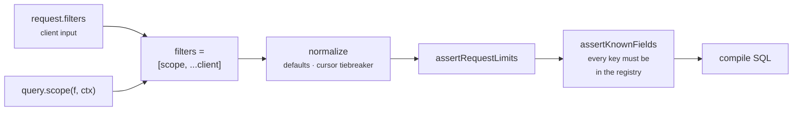

A scope is a filter the server adds to every request. It runs before the client's filters are read, and no request payload can remove it.

Tenancy expressed as a scope is structural — there is no controller left to forget it.

## Where a scope enters the pipeline



The scope is merged **before** validation, not after. Everything downstream treats its conditions as ordinary request filters — including the registry check that rejects unknown keys.

## Declaring a scope

`query.scope` receives a typed filter builder and the caller's context, and returns filter nodes:

```ts twoslash
import { engine } from "./engine";
// ---cut-before---
export const ordersResource = engine.defineResource("orders", {
  relations: { customer: true },
  query: {
    scope: (f, ctx) => f.is("customer.orgId", ctx.orgId),
  },
});
```

The builder is typed from the resource's `relations`, so `customer.orgId` autocompletes and a path outside the declared tree fails to compile.

Return a single condition, a group, an array of nodes, or `undefined` for no constraint. [Filter Builder](/reference/filter-builder) lists every method.

## Merge order

The engine puts the scope node first and appends the client's nodes after it:

```ts twoslash
import type { QueryFilters } from "drizzle-resource";

import { f } from "./twoslash-support";
// ---cut-before---
// The array the compiler receives, for a scope on `customer.orgId`
const merged: QueryFilters = [
  f.is("customer.orgId", "acme"), // scope
  f.is("status", "pending"), // client
];
```

The top-level `filters` array is combined with an implicit `and`, so client input can only narrow the result set. A client `or` group nests inside that `and` and never escapes it.

An array returned from `scope` is wrapped into a single `and` group before merging, which keeps multi-condition scopes as one node.

## Never scope on a removed path

::warning
A scope filter may not reference a **hidden or disabled** field path. `filters.hidden` and `filters.disabled` both delete the path from the registry, the scope's conditions are merged into `request.filters`, and the registry check then rejects them — the query throws `Unknown filter field "deletedAt" for resource "orders"` on every call.
::

This configuration compiles cleanly and fails on the first request:

```ts twoslash
import { engine } from "./engine";
// ---cut-before---
export const brokenOrders = engine.defineResource("orders", {
  relations: { customer: true },
  query: {
    // `deletedAt` is deleted from the registry here...
    filters: { disabled: ["deletedAt"] },
    // ...and referenced here. Every query throws.
    scope: (f, ctx) => f.and([f.is("customer.orgId", ctx.orgId), f.is("deletedAt", null)]),
  },
});
```

Field-path types come from the schema and the relation tree, not from the registry, so the compiler cannot catch this. The failure surfaces at query time.

The fix is to keep the path registered and move the client restriction to the validator, where `allow` narrows the contract without touching the registry:

```ts twoslash
import { requestSchema } from "drizzle-resource/zod";

import { engine } from "./engine";
// ---cut-before---
const ordersResource = engine.defineResource("orders", {
  relations: { customer: true },
  query: {
    // No `filters.disabled` — `deletedAt` stays in the registry
    scope: (f, ctx) => f.and([f.is("customer.orgId", ctx.orgId), f.is("deletedAt", null)]),
  },
});

// The client contract has no `deletedAt`; the scope still filters on it
const parseOrdersRequest = requestSchema(ordersResource, {
  allow: { filters: ["status", "createdAt", "reference", "customer.name"] },
});
```

Leaving the path filterable is safe in its own right — the scope is AND-ed with client filters, so a client condition on `deletedAt` can only narrow an already-scoped set.

The other option is to keep the path out of the registry and enforce the predicate in raw SQL inside [`strategy.ids`](/resource-setup/strategies#strategyids), which runs below the registry entirely.

## Bypassing the scope for trusted callers

Return `undefined` when the context should see everything:

```ts twoslash
import { engine } from "./engine";
// ---cut-before---
export const ordersResource = engine.defineResource("orders", {
  relations: { customer: true },
  query: {
    scope: (f, ctx) => (ctx.isAdmin ? undefined : f.is("customer.orgId", ctx.orgId)),
  },
});
```

No scope node is merged, and the request runs with the client's filters alone. Returning `f.and([])` also works — an empty group compiles to `true` — but `undefined` keeps the filter tree one node smaller.

## Combining conditions

Nest groups to express anything the filter tree supports:

```ts twoslash
import { engine } from "./engine";
// ---cut-before---
export const ordersResource = engine.defineResource("orders", {
  relations: { customer: true },
  query: {
    scope: (f, ctx) =>
      f.and([
        f.is("customer.orgId", ctx.orgId),
        f.or([f.is("status", "shipped"), f.is("isPriority", true)]),
      ]),
  },
});
```

Every condition still resolves through the same field registry, so the same removed-path rule applies to nested nodes.

::note
Scope conditions count toward `maxFilterNodes` and `maxFilterDepth`, and a wrapping `and` group adds one level to every client node beneath it. See [Request Limits](/resource-setup/limits#scope-counts-toward-the-filter-limits).
::

## Where the scope applies

All four query methods normalize through the same path, so `query`, `queryIds`, `queryRows`, and `queryFacets` each merge and validate the scope.

::warning
Merging is not the same as filtering for `queryRows`. Row hydration selects by id — `findMany({ where: { id: { in: ids } } })` — so the scope does not restrict which ids are hydrated. Resolve ids through `queryIds` before passing them to `queryRows`, and never hydrate ids that came straight from a client.
::

## Reusing a scope across resources

`engine.defineScope` builds a standalone handler that several resources can share:

```ts twoslash
import { engine } from "./engine";
// ---cut-before---
const ordersWith = {
  customer: true,
  orderLines: { with: { product: true } },
} as const;

const orgScope = engine.defineScope("orders", ordersWith, (ctx, f) =>
  ctx.isAdmin ? undefined : f.is("customer.orgId", ctx.orgId),
);

export const ordersResource = engine.defineResource("orders", {
  relations: ordersWith,
  query: { scope: orgScope },
});
```

::caution
`defineScope` takes its handler as `(context, filters)` — the reverse of an inline `query.scope(filters, context)`. Both arguments are typed, so swapping them is a compile error rather than a silent bug.
::

Declare the relation tree once and pass the same object to both calls. The handler's field-path union is derived from the tree given to `defineScope`, and a resource with a different tree will not accept it.

## Next steps

- [Field Policy](/resource-setup/field-policy) — which settings remove a path and which only narrow it
- [Filter Trees](/query-contract/filters) — the node shapes a scope returns
- [Request Limits](/resource-setup/limits) — how scope nodes count against the filter budget
- [Unit Testing](/integration/testing) — asserting that a scope is actually enforced
