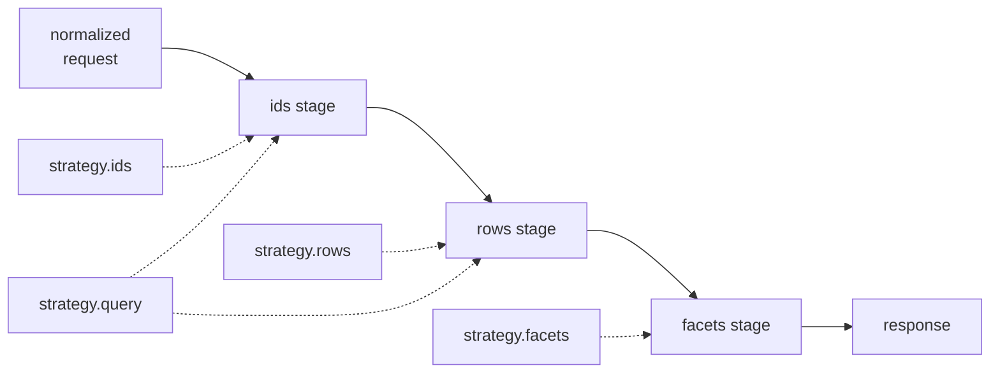

A strategy replaces one stage of the query pipeline with your own implementation. The request contract, the response shape, and every other stage stay exactly as they were.

Reach for one when a stage is measurably too slow, or when a predicate cannot be expressed as a registered field path.

## Which stage each override replaces



| Override | Replaces                          | Returns                                   |
| -------- | --------------------------------- | ----------------------------------------- |
| `ids`    | Page id selection and the count   | `Promise<QueryIdsResponse<TId>>`          |
| `rows`   | Row hydration for a known id list | `Promise<TRow[]>`                         |
| `facets` | Facet bucket resolution           | `Promise<QueryFacetsResponse<TFacetKey>>` |
| `query`  | The ids and rows stages together  | `Promise<QueryResponse<TRow>>`            |

Setting `query` skips `ids` and `rows` entirely — the engine never calls them.

## What a strategy can assume

Every override receives `{ request, context, resource, utils }`, and `rows` additionally receives `ids`.

- `request` is fully normalized. Defaults are applied, cursor mode has already appended the `id` tiebreaker, and every filter, sort, search, and facet key has been checked against the registry.
- `context` is optional — it is whatever the caller passed to `resource.query({ context })`, or `undefined`.
- `resource` exposes `fields` and `queryConfig`, so a strategy can read the same policy the engine enforces.
- `utils` is memoized per resource and shares the field registry, the compiled join plans, and the filter compiler. [Strategy Utils](/reference/strategy-utils) documents all twelve helpers.

Nothing is re-validated after a strategy returns. What you return is what the caller receives.

## `strategy.ids`

The ids stage decides which rows the page contains, and it is where almost all query time goes. Overriding it hands you the join plan, the pagination arithmetic, and the page metadata.

This implementation handles both pagination modes, applies a predicate on a column that is deliberately outside the registry, and returns the matching `pageInfo` variant:

```ts twoslash [orders.resource.ts]
import { drizzle } from "drizzle-orm/node-postgres";
import { createQueryEngine } from "drizzle-resource";

import {
  and,
  count,
  customers,
  desc,
  eq,
  inArray,
  lt,
  or,
  orders,
  relations,
  schema,
  sql,
} from "./twoslash-support";

const db = drizzle("postgres://localhost:5432/app", { relations });

const engine = createQueryEngine({ db, schema, relations }).withContext<{
  isAdmin?: boolean;
  orgId: string;
}>();

export const ordersResource = engine.defineResource("orders", {
  relations: { customer: true, orderLines: { with: { product: true } } },
  query: {
    scope: (f, ctx) => f.is("customer.orgId", ctx.orgId),
    sort: { defaults: [{ key: "createdAt", dir: "desc" }] },
    pagination: { modes: ["offset", "cursor"] },
  },
  strategy: {
    ids: async ({ context, request, utils }) => {
      const pageSize = request.pagination.pageSize;
      const visibleStatuses = context?.isAdmin
        ? ["pending", "processing", "shipped", "cancelled"]
        : ["pending", "processing", "shipped"];

      // `buildWhereClause` takes the whole request — filters and search together
      const where = and(
        utils.buildWhereClause(request),
        inArray(orders.status, visibleStatuses),
        sql`${orders.deletedAt} is null`,
      );

      if (request.pagination.mode === "cursor") {
        const [afterCreatedAt, afterId] = (request.pagination.cursor ?? "").split("|");
        const keyset =
          afterCreatedAt && afterId
            ? or(
                lt(orders.createdAt, new Date(afterCreatedAt)),
                and(eq(orders.createdAt, new Date(afterCreatedAt)), lt(orders.id, afterId)),
              )
            : undefined;

        const lookahead = await db
          .select({ id: orders.id, createdAt: orders.createdAt })
          .from(orders)
          .innerJoin(customers, eq(orders.customerId, customers.id))
          .where(and(where, keyset))
          .orderBy(desc(orders.createdAt), desc(orders.id))
          .limit(pageSize + 1);

        const page = lookahead.slice(0, pageSize);
        const last = page[page.length - 1];

        return {
          ids: page.map((row) => row.id),
          pageInfo: {
            mode: "cursor",
            pageSize,
            nextCursor:
              lookahead.length > pageSize && last
                ? `${last.createdAt.toISOString()}|${last.id}`
                : null,
            count: "none",
            rowCount: null,
          },
        };
      }

      const [counted] = await db
        .select({ rowCount: count() })
        .from(orders)
        .innerJoin(customers, eq(orders.customerId, customers.id))
        .where(where);
      const rowCount = Number(counted?.rowCount ?? 0);

      const page = await db
        .select({ id: orders.id })
        .from(orders)
        .innerJoin(customers, eq(orders.customerId, customers.id))
        .where(where)
        .orderBy(...utils.compileOrderBy(request.sorting))
        .limit(pageSize)
        .offset((request.pagination.pageIndex - 1) * pageSize);

      return {
        ids: page.map((row) => row.id),
        pageInfo: {
          mode: "offset",
          pageIndex: request.pagination.pageIndex,
          pageSize,
          hasNextPage: request.pagination.pageIndex * pageSize < rowCount,
          count: "exact",
          rowCount,
        },
      };
    },
  },
});
```

The cursor branch reads one row past the page so it knows whether a next page exists — without that lookahead there is no way to decide between a cursor and `null`.

Four details in that example are load-bearing:

- **`utils.buildWhereClause(request)`** takes the whole request, compiling `filters` and `search` into one clause. Scope conditions are already inside `request.filters` by this point.
- **The `customers` join is mandatory.** That clause emits real column references, so any `one`-relation path in the tree — including the scope's `customer.orgId` — needs its join present in your query. Paths through a `many` relation compile to self-contained `EXISTS` subqueries and need no join.
- **`utils.compileOrderBy(request.sorting)`** spreads straight into `orderBy(...)`, and skips any key the registry marks non-sortable.
- **The cursor format is now yours.** The engine's cursor codec is internal, so a hand-rolled ids stage defines and parses its own format — and must keep it under `maxCursorLength`.

::caution
The built-in ids stage uses `selectDistinct` because relation joins can duplicate root rows. A hand-written query that joins a `many` relation must deduplicate itself, or the page will contain the same order twice.
::

## `strategy.rows`

The rows stage hydrates a known, ordered id list. It returns `TRow[]` directly — not an object wrapping them:

```ts twoslash
import { engine } from "./engine";
import type { OrderRow } from "./twoslash-support";
// ---cut-before---
const rowCache = new Map<string, OrderRow>();

export const ordersResource = engine.defineResource("orders", {
  relations: { customer: true, orderLines: { with: { product: true } }, tags: true },
  strategy: {
    rows: async ({ ids, request, utils }) => {
      const cached = ids.map((id) => rowCache.get(id)).filter((row) => row !== undefined);
      if (cached.length === ids.length) return cached;

      const rows = await utils.executeRowsQuery({ ids, request });
      for (const row of rows) rowCache.set(row.id, row);
      return rows;
    },
  },
});
```

Two contract rules apply: return the rows in the id order you were given, and return one row per id you can resolve.

`utils.executeRowsQuery({ ids, request })` handles both — it deduplicates the id list and restores the requested order after Drizzle returns. Delegate to it whenever the default hydration query is adequate.

## `strategy.facets`

The facet stage resolves bucket lists. Use it to refuse an expensive facet without changing the response shape the client expects:

```ts twoslash
import { engine } from "./engine";
// ---cut-before---
export const ordersResource = engine.defineResource("orders", {
  relations: { customer: true, tags: true },
  query: { facets: { allowed: ["status", "customer.name", "tags.name"] } },
  strategy: {
    facets: async ({ facets, request, utils }) => {
      const cheap = facets.filter((facet) => facet.key !== "tags.name");
      const resolved = await utils.resolveFacets({ request, facets: cheap });
      const buckets = new Map(resolved.facets.map((facet) => [facet.key, facet.options]));

      return {
        facets: facets.map((facet) => ({
          key: facet.key,
          options: buckets.get(facet.key) ?? [],
        })),
      };
    },
  },
});
```

Mapping over the requested facets rather than the resolved ones keeps the response keyed exactly as the client asked, so a skipped facet returns an empty bucket list instead of disappearing.

This override serves both `resource.queryFacets(...)` and the facet step inside `resource.query(...)`.

## `strategy.query`

`query` replaces the ids and rows stages as one unit. `utils.executeHydratedPage({ request })` runs the built-in pair, which makes instrumentation a one-line wrapper:

```ts twoslash
import { engine } from "./engine";
// ---cut-before---
export const ordersResource = engine.defineResource("orders", {
  relations: { customer: true },
  strategy: {
    query: async ({ request, utils }) => {
      const startedAt = Date.now();
      const page = await utils.executeHydratedPage({ request });
      console.info("orders page", { ms: Date.now() - startedAt, rows: page.rows.length });
      return page;
    },
  },
});
```

Facets are still resolved after this override returns, unless the response already carries a `facets` key — set it yourself to take over that stage too.

## When to override

Start with no strategy at all. The built-in pipeline is correct, and it already shares one `matchingIds` CTE across the page, the count, and every facet.

Override in this order:

1. Add indexes and measure. [Optimization](/performance/optimization) covers the `lower(col)` expression indexes text matching needs.
2. Switch the endpoint to cursor pagination if it is paging deeply.
3. Override `ids` when a profile shows the id stage dominating.
4. Override `rows`, `facets`, or `query` only for a requirement the declarative surface cannot express.

Each override you add is a join plan you now maintain by hand, and one the field registry no longer keeps in sync for you.

## Next steps

- [Strategy Utils](/reference/strategy-utils) — all twelve helpers and their true signatures
- [Query Pipeline](/core-concepts/query-pipeline) — what each stage runs by default
- [Optimization](/performance/optimization) — the ordered playbook before reaching for a strategy
- [Execution Cost](/performance/execution-cost) — where the time actually goes
