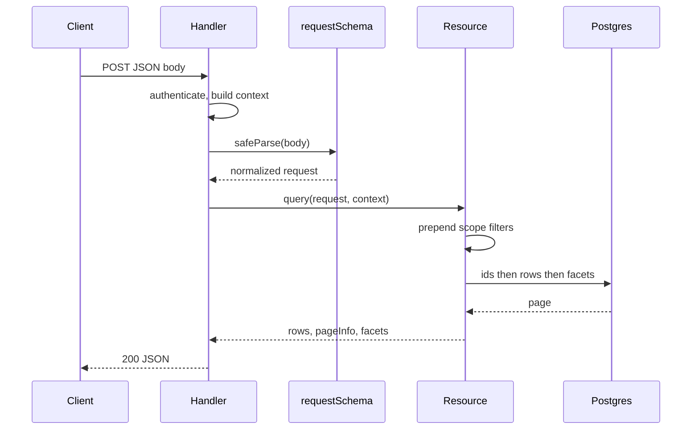

A resource endpoint is four steps: validate the body, build `context` from the session, call `query`, return the response. Nothing else belongs in the handler.



The client controls the request. The server controls the context. Those two never mix.

## The complete handler

Use the web-standard `Request` and `Response` pair — every other runtime is a thin rename of this:

```ts twoslash [orders.handler.ts]
import { requestSchema } from "drizzle-resource/zod";

import { ordersResource } from "./orders.resource";

/** Your own session lookup — cookie, bearer token, or platform helper. */
declare function authenticate(
  httpRequest: Request,
): Promise<{ orgId: string; userId: string } | null>;

// Build the schema once at module scope, never per request.
const ordersRequestSchema = requestSchema(ordersResource);

export async function handleOrdersQuery(httpRequest: Request): Promise<Response> {
  const session = await authenticate(httpRequest);
  if (!session) {
    return Response.json({ error: "Unauthenticated" }, { status: 401 });
  }

  const parsed = ordersRequestSchema.safeParse(await httpRequest.json());
  if (!parsed.success) {
    return Response.json(
      { error: "Invalid query request", issues: parsed.error.issues },
      { status: 400 },
    );
  }

  const result = await ordersResource.query({
    context: { orgId: session.orgId, userId: session.userId },
    request: parsed.data,
  });

  return Response.json(result);
}
```

`safeParse` returns a discriminated result instead of throwing, so a malformed body never reaches the engine and never becomes an exception.

Every request key has a default, so `{}` is a valid body — it resolves to the resource's default pagination, default sorting, and default search fields. A table that has not been touched yet can post an empty object.

::note
Build the schema once at module scope. `requestSchema` walks the field registry and resolves the endpoint contract on every call, and that work does not change between requests.
::

## Context never comes from the body

Tenancy is a server fact. Read it from the session and pass it as `context`, which is a separate argument from `request`:

```ts twoslash
import { requestSchema } from "drizzle-resource/zod";

import { ordersResource } from "./orders.resource";

const ordersRequestSchema = requestSchema(ordersResource);

// A client trying to smuggle tenancy into the payload fails to parse.
const smuggled = ordersRequestSchema.safeParse({
  pagination: { mode: "offset", pageIndex: 1, pageSize: 25 },
  context: { orgId: "someone-elses-org" },
});

if (!smuggled.success) {
  console.log(smuggled.error.issues[0].message);
  // Unrecognized key: "context"
}
```

Two independent mechanisms enforce this. The request schema is a `strictObject`, so an unknown top-level key is a parse error — and the engine overwrites `request.context` with `{}` during normalization, so a body that skipped validation still cannot reach a scope function.

::warning
Never copy a value out of the body into `context`. `context` is the only input the scope function trusts, and a scope filter built from client data is not a scope filter.
::

## Framework variants

The same four steps, in each runtime's own vocabulary:

::code-group

```ts [Nitro / Nuxt]
// server/api/orders.post.ts
import { requestSchema } from "drizzle-resource/zod";

import { ordersResource } from "../utils/orders.resource";

const ordersRequestSchema = requestSchema(ordersResource);

export default defineEventHandler(async (event) => {
  const session = await requireSession(event); // your auth layer
  const parsed = ordersRequestSchema.safeParse(await readBody(event));

  if (!parsed.success) {
    throw createError({ statusCode: 400, statusMessage: "Invalid query request" });
  }

  return await ordersResource.query({
    context: { orgId: session.orgId, userId: session.userId },
    request: parsed.data,
  });
});
```

```ts [Hono]
import { Hono } from "hono";
import { requestSchema } from "drizzle-resource/zod";

import { ordersResource } from "./orders.resource";

const ordersRequestSchema = requestSchema(ordersResource);
const app = new Hono();

app.post("/api/orders", async (c) => {
  const session = await requireSession(c.req.raw); // your auth layer
  const parsed = ordersRequestSchema.safeParse(await c.req.json());

  if (!parsed.success) {
    return c.json({ error: "Invalid query request" }, 400);
  }

  const result = await ordersResource.query({
    context: { orgId: session.orgId, userId: session.userId },
    request: parsed.data,
  });

  return c.json(result);
});
```

```ts [Express]
import express from "express";
import { requestSchema } from "drizzle-resource/zod";

import { ordersResource } from "./orders.resource";

const ordersRequestSchema = requestSchema(ordersResource);
const app = express();

app.post("/api/orders", express.json(), async (req, res) => {
  const session = await requireSession(req); // your auth layer
  const parsed = ordersRequestSchema.safeParse(req.body);

  if (!parsed.success) {
    res.status(400).json({ error: "Invalid query request" });
    return;
  }

  const result = await ordersResource.query({
    context: { orgId: session.orgId, userId: session.userId },
    request: parsed.data,
  });

  res.json(result);
});
```

::

Only the body reader and the response writer change. The validate, scope, query sequence is identical, which is what makes one resource serve several transports.

## Status codes

| Situation                             | Status                  | Raised by       |
| ------------------------------------- | ----------------------- | --------------- |
| No session                            | `401`                   | your auth layer |
| `safeParse` fails                     | `400`                   | the validator   |
| `query` throws a field or limit error | `400`                   | the engine      |
| Scope excludes every row              | `200` with empty `rows` | the engine      |
| Anything else                         | `500`                   | —               |

A scoped resource never answers `403`. Tenancy is a filter, so a caller reaching for another organization's rows gets an empty page rather than a refusal — the endpoint does not reveal that the rows exist.

Mapping a thrown engine error onto `400` takes some care, because the engine throws plain `Error` objects with no code. [Error Handling](/integration/error-handling) has the full surface and a mapping helper.

## POST, not GET

The request is a nested object — a recursive filter tree, a sort array, and a facet array. That does not flatten into query parameters, so `POST` with a JSON body is the natural transport even though the operation is a read.

When a route must be cacheable, encode the whole payload as one JSON-encoded query parameter and parse it before validation. Do not spread the tree across many parameters; the validator expects the object shape.

::note
`Response.json` serializes `Date` columns to ISO strings, so `createdAt` arrives as a string on the client even though the server row type says `Date`. [Data Tables](/integration/data-tables) covers how to keep both sides honest about that.
::

## Next steps

- [Validation](/integration/validation) — what `requestSchema` defaults, and how to narrow it per endpoint
- [Error Handling](/integration/error-handling) — the real error messages and how to map them to a status
- [Scope Rules](/resource-setup/scope) — how `context` becomes a filter on every query
- [Data Tables](/integration/data-tables) — turning table UI state into this payload
