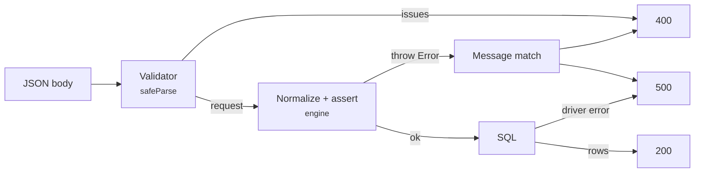

`drizzle-resource` throws plain `new Error(...)`. There is no error class, no `code` property, and no status hint — only a message string.

That is the whole error surface, and it shapes every recommendation on this page. Plan for it rather than around it.



## Keep validator failures off the exception path

Use `safeParse`, never `parse`, in a request handler. A parse failure then arrives as a value you can branch on, and every remaining exception is by definition an engine or driver failure:

```ts twoslash [orders.handler.ts]
import { requestSchema } from "drizzle-resource/zod";

import { ordersResource } from "./orders.resource";

const ordersRequestSchema = requestSchema(ordersResource);

export async function queryOrders(body: unknown, orgId: string) {
  const parsed = ordersRequestSchema.safeParse(body);

  // Validator failure: a value, carrying a field path per issue.
  if (!parsed.success) {
    return { status: 400 as const, issues: parsed.error.issues };
  }

  // Engine failure: an exception, carrying only a message.
  const result = await ordersResource.query({ context: { orgId }, request: parsed.data });

  return { status: 200 as const, result };
}
```

This split is worth enforcing in review. Once `parse` throws inside the same `try` as `query`, both failure kinds land in one `catch` and the only way back out is inspecting error shapes.

The same rule holds for Valibot — `v.safeParse(schema, body)` returns `{ success, issues }` rather than throwing.

## Request errors

These come from `assertRequestLimits` and `assertKnownFields`, which run on every call to `query`, `queryIds`, `queryRows`, and `queryFacets` before any SQL is built. Values in angle brackets are interpolated.

| Message                                                         | Cause                                                                                   |
| --------------------------------------------------------------- | --------------------------------------------------------------------------------------- |
| `Unknown sorting field "<field>" for resource "<name>"`         | sort key is not in the field registry                                                   |
| `Sorting field "<field>" is not allowed for resource "<name>"`  | key exists but is not sortable — listed in `sort.disabled`, or behind a `many` relation |
| `Unknown search field "<field>" for resource "<name>"`          | search field is not in `search.allowed`                                                 |
| `Unknown filter field "<field>" for resource "<name>"`          | filter key is not in the field registry, including `hidden` and `disabled` paths        |
| `Unknown facet field "<field>" for resource "<name>"`           | facet key is not in `facets.allowed`                                                    |
| `Pagination mode "<mode>" is not allowed for resource "<name>"` | mode is not in `pagination.modes`                                                       |
| `Page size cannot exceed <n>`                                   | `maxPageSize`, default `100`                                                            |
| `Cursor cannot exceed <n> characters`                           | `maxCursorLength`, default `2048`                                                       |
| `Filter tree cannot exceed <n> levels`                          | `maxFilterDepth`, default `5`                                                           |
| `Filter tree cannot exceed <n> nodes`                           | `maxFilterNodes`, default `50`                                                          |
| `A request cannot contain more than <n> facets`                 | `maxFacetCount`, default `10`                                                           |
| `Facet limit cannot exceed <n>`                                 | `maxFacetLimit`, default `50`                                                           |

Facet keys are the exception to "before any SQL". They are checked at the facet stage, so `query()` runs the ids and rows queries first and only then rejects an unknown facet key.

## Cursor errors

Cursor decoding is deliberately opaque. Every decode failure — tampering, truncation, a payload from another resource, or a sorting change since the cursor was issued — collapses into one message:

| Message                                                   | Cause                                                              |
| --------------------------------------------------------- | ------------------------------------------------------------------ |
| `Invalid cursor`                                          | the cursor did not decode against this resource and this sorting   |
| `Cursor values must be database scalar values`            | a sort column produced a non-scalar while encoding the next cursor |
| `Cursor value count does not match the effective sorting` | encoding invariant broken, from a custom `strategy.ids`            |

Only the first is reachable by a client. The internal messages `Invalid cursor date` and `Cursor payload does not match this query` exist in the source but are caught and rethrown as `Invalid cursor`, so no caller sees them.

## Startup errors

These throw while the module loads, not per request. A misconfigured resource fails the deploy instead of the first request:

| Message                                                                 | Thrown by        |
| ----------------------------------------------------------------------- | ---------------- |
| `Resource "<name>" must allow at least one pagination mode`             | `defineResource` |
| `Default pagination mode "<mode>" is not allowed for resource "<name>"` | `defineResource` |
| `Cursor pagination requires a visible, sortable root "id" field`        | `defineResource` |
| `Default sorting field "<field>" is not allowed for resource "<name>"`  | `requestSchema`  |
| `Default pagination mode "<mode>" is not allowed for resource "<name>"` | `requestSchema`  |
| `Unknown table "<name>" in resource response schema`                    | `responseSchema` |
| `Unknown relation "<name>" on table "<table>"`                          | `responseSchema` |

Never map these to a status code. If one reaches a request handler, the module was built lazily inside the handler — hoist it to module scope instead.

## Internal invariants

Three messages report a broken relation path while compiling SQL: `Invalid many relation path for field "<field>"`, `Invalid relation step while resolving field "<field>"`, and `Invalid many relation path for facet "<field>"`. They indicate a mismatch between the schema and the relation graph, not client input. Treat them as `500`.

## Mapping a throw to a status

The only discriminator available today is the message text. Collect the client-caused messages into one list and default everything else to `500`:

```ts twoslash [http-error.ts]
/** Engine messages caused by a request the client could have sent correctly. */
const clientErrorPatterns: readonly RegExp[] = [
  /^Unknown (?:sorting|search|filter|facet) field "/u,
  /^Sorting field "/u,
  /^Pagination mode "/u,
  /^Page size cannot exceed /u,
  /^Cursor cannot exceed /u,
  /^Filter tree cannot exceed /u,
  /^A request cannot contain more than /u,
  /^Facet limit cannot exceed /u,
  /^Invalid cursor$/u,
];

export function isClientQueryError(error: unknown): error is Error {
  return (
    error instanceof Error && clientErrorPatterns.some((pattern) => pattern.test(error.message))
  );
}

export function toStatus(error: unknown): 400 | 500 {
  return isClientQueryError(error) ? 400 : 500;
}
```

Keep that list in exactly one module. It is the single place that has to change if a message is ever reworded.

Wrapping the call then stays short:

```ts twoslash [orders.handler.ts]
import { requestSchema } from "drizzle-resource/zod";

import { ordersResource } from "./orders.resource";

declare function toStatus(error: unknown): 400 | 500;
declare function reportToSentry(error: unknown): void;

const ordersRequestSchema = requestSchema(ordersResource);

export async function handleOrdersQuery(body: unknown, orgId: string): Promise<Response> {
  const parsed = ordersRequestSchema.safeParse(body);
  if (!parsed.success) {
    return Response.json({ error: "Invalid query request" }, { status: 400 });
  }

  try {
    const result = await ordersResource.query({ context: { orgId }, request: parsed.data });
    return Response.json(result);
  } catch (error) {
    const status = toStatus(error);
    if (status === 500) reportToSentry(error);
    return Response.json({ error: (error as Error).message }, { status });
  }
}
```

Alerting on the `500` branch only is the point of the split. A client sending a stale cursor should not page anyone.

::warning
Error messages are not a stable public API. They carry no version guarantee, so pin the package version you tested against and cover the mapping helper with tests that assert real thrown messages, not hand-written strings.
::

## One message, two very different causes

`Unknown filter field "<field>"` is raised for any filter key missing from the registry — and scope filters are merged into the same array as client filters before the check runs.

So a resource that hides or disables a path its scope function filters on throws on every request, with a message that reads like client error:

```ts
// query.filters.disabled removes "deletedAt" from the registry entirely
scope: (f, ctx) => f.and([f.is("customer.orgId", ctx.orgId), f.is("deletedAt", null)]);
// Error: Unknown filter field "deletedAt" for resource "orders"
```

Before returning `400`, confirm the offending key actually came from the request body. When it did not, the resource is misconfigured and the correct answer is `500` plus an alert — see [Field Policy](/resource-setup/field-policy).

::note
Echoing the engine message back to the client is safe for the request errors above — they name a field path the client already sent. Do not echo messages from the `500` branch; a driver error can carry table and column names the caller has no business seeing.
::

## Next steps

- [HTTP Endpoints](/integration/http-endpoints) — the handler this mapping plugs into
- [Validation](/integration/validation) — rejecting bad input before it reaches the engine
- [Request Limits](/resource-setup/limits) — tuning the six thresholds behind half of these messages
- [Unit Testing](/integration/testing) — asserting the real messages instead of copies
