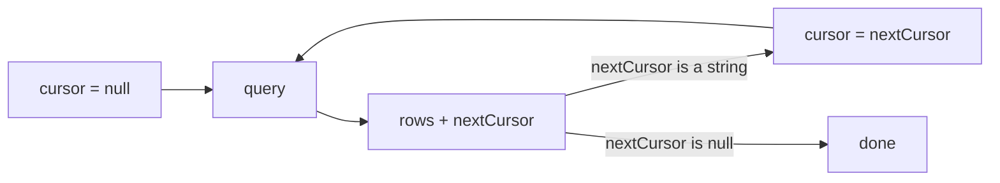

Cursor mode replaces a page number with an opaque `nextCursor`. Send it back to get the next slice, and stop when it is `null`.



Each page is a fresh request with a different cursor. Nothing is held server-side between pages.

## Enabling cursor mode

Offset is the only mode a resource allows by default. Opt in explicitly, and make the default mode match if the endpoint is cursor-first:

```ts twoslash [orders.resource.ts]
import { engine } from "./engine";
// ---cut-before---
export const ordersResource = engine.defineResource("orders", {
  relations: { customer: true },
  query: {
    defaults: { pagination: { mode: "cursor", pageSize: 25 } },
    pagination: { modes: ["cursor", "offset"] },
    scope: (f, ctx) => f.is("customer.orgId", ctx.orgId),
    sort: { defaults: [{ dir: "desc", key: "createdAt" }] },
  },
});
```

Cursor mode requires a visible, sortable root `id` — `defineResource` throws at startup otherwise, because a cursor needs a total ordering to resume from.

The engine appends `{ key: "id" }` to the sorting whenever a cursor request omits it, inheriting the direction of the last descriptor. Two orders sharing a `createdAt` would otherwise repeat or vanish across a page boundary.

## The loop

Feed `nextCursor` back into the next request and keep everything else identical:

```ts twoslash [load-more.ts]
import type { QueryRequestInput } from "drizzle-resource";

import { ordersResource } from "./orders.resource";

const listQuery = {
  filters: [],
  search: { fields: [], value: "" },
  sorting: [{ dir: "desc", key: "createdAt" }],
} satisfies Omit<QueryRequestInput, "pagination">;

export async function loadPage(cursor: string | null, orgId: string) {
  const page = await ordersResource.query({
    context: { orgId },
    request: { ...listQuery, pagination: { mode: "cursor", cursor, pageSize: 25 } },
  });

  return {
    nextCursor: page.pageInfo.mode === "cursor" ? page.pageInfo.nextCursor : null,
    rows: page.rows,
  };
}
```

Passing `cursor: null` returns the first page, so the same function serves the initial load and every "load more" press.

Cursor requests default to `count: "none"`, which is the point — the engine reads `pageSize + 1` rows and uses the extra row to decide whether to emit a `nextCursor`, instead of running a `count(*)`. Ask for `count: "exact"` only when the UI shows a total, and expect a second query for it.

Cursor `pageInfo` carries no `hasNextPage` field at all. `nextCursor === null` is the end-of-list signal.

## When a cursor goes stale

A cursor encodes four things: a version, the resource key, the effective sorting, and the sort-column values of the last row on the page. Anything outside that list is invisible to it.

| Change between pages                | Behavior                                                                       | What to do                 |
| ----------------------------------- | ------------------------------------------------------------------------------ | -------------------------- |
| `sorting` changed                   | throws `Invalid cursor`                                                        | reset the cursor to `null` |
| A different resource's cursor       | throws `Invalid cursor`                                                        | reset to `null`            |
| Cursor tampered with or truncated   | throws `Invalid cursor`                                                        | reset to `null`            |
| `filters` changed                   | **no error** — resumes from a boundary that no longer matches the visible list | reset to `null`            |
| `search` changed                    | **no error** — same silent skip                                                | reset to `null`            |
| `context` changed, so scope changed | **no error** — same silent skip                                                | reset to `null`            |
| `pageSize` changed                  | safe, the next slice is simply a different size                                | keep the cursor            |

::warning
Only a sorting change is detected. A filter, search, or scope change keeps decoding cleanly and silently continues from the old boundary, which skips every row that now sorts before it. Reset the cursor to `null` whenever any request key other than `pagination` changes.
::

The practical rule is one line of client state management — derive a key from everything except pagination, and clear the cursor when that key changes:

```ts twoslash [load-more.ts]
import type { QueryRequestInput } from "drizzle-resource";

/** Anything in this key changing invalidates the cursor. */
export function listKey(request: QueryRequestInput): string {
  return JSON.stringify({
    filters: request.filters,
    search: request.search,
    sorting: request.sorting,
  });
}
```

Scope is not part of that key, because the client never sees it. A session switching organizations must discard cursors along with the rest of its cached state.

## Exporting a full result set

Traversal is the supported way to read every matching row. Loop until `nextCursor` is `null`, with a hard cap so a bug cannot spin forever:

```ts twoslash [export-orders.ts]
import type { QueryRequestInput } from "drizzle-resource";

import { ordersResource } from "./orders.resource";

const exportQuery = {
  filters: [],
  search: { fields: [], value: "" },
  sorting: [{ dir: "desc", key: "createdAt" }],
} satisfies Omit<QueryRequestInput, "pagination">;

type OrdersPage = Awaited<ReturnType<typeof ordersResource.query>>;

export async function exportAllOrders(orgId: string, maxPages = 1_000) {
  const rows: OrdersPage["rows"] = [];
  let cursor: string | null = null;
  let pages = 0;

  do {
    const page: OrdersPage = await ordersResource.query({
      context: { orgId },
      request: { ...exportQuery, pagination: { cursor, mode: "cursor", pageSize: 100 } },
    });

    rows.push(...page.rows);
    cursor = page.pageInfo.mode === "cursor" ? page.pageInfo.nextCursor : null;
    pages += 1;
  } while (cursor !== null && pages < maxPages);

  return rows;
}
```

Sort descending on an insert-ordered column and the traversal is bounded. Rows written after the export starts sort ahead of the first cursor, so the loop walks backwards through a fixed set instead of chasing new writes.

Sorting ascending does the opposite — every insert lands past the cursor and joins the export. That is correct for a backfill and wrong for a report, which is what the `maxPages` cap is for.

`maxPageSize` defaults to `100`, so a 250 000-row export is 2 500 round trips. Raise the resource limit for a trusted internal job rather than looping at the default.

::tip
When the export only needs keys — to enqueue jobs, or to hand ids to another service — use `queryIds` instead. It returns `{ ids, pageInfo }` and skips row hydration entirely, which removes the relational `findMany` from every iteration.
::

Offset mode is the wrong tool here. `LIMIT … OFFSET` re-scans and discards every earlier row, so page 500 costs 500 pages of work, and a concurrent insert shifts every subsequent page. Cursor mode reads a boundary comparison instead.

## Next steps

- [Pagination](/query-contract/pagination) — the mode union, count policy, and `pageInfo` narrowing
- [Data Tables](/integration/data-tables) — the offset variant, for numbered pagers
- [Error Handling](/integration/error-handling) — mapping `Invalid cursor` to a status
- [Sort Order](/query-contract/sorting) — the tiebreaker cursor mode appends
