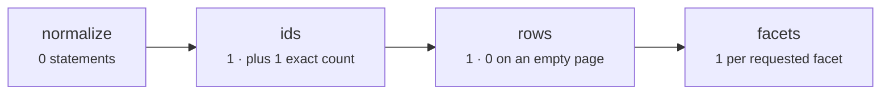
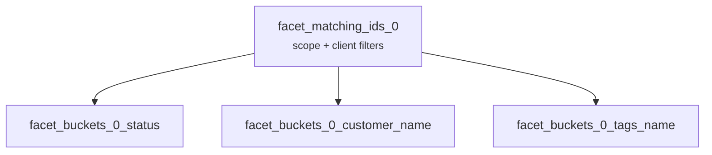

A resource query costs what its SQL costs. Four stages run, and only two of them can be slow — **ids** and **facets**.

This page maps each stage to the statement it issues, then maps each field path to the SQL its cardinality forces.

## Statements per request



| Stage     | Statements                                 | Grows with                                             |
| --------- | ------------------------------------------ | ------------------------------------------------------ |
| Normalize | 0                                          | Nothing — pure computation                             |
| Ids       | 1, plus 1 when `count: "exact"`            | Predicate complexity, join depth, offset depth         |
| Rows      | 1, or 0 when the ids stage returns nothing | Page size and declared relation breadth                |
| Facets    | 1 per requested facet                      | Facet count and the cardinality of each grouped column |

A page of 25 rows with three facets and an exact count issues six statements. The stage names come from [Query Pipeline](/core-concepts/query-pipeline).

## Normalize costs nothing

Scope merge, defaults, limit checks, and field validation are pure computation. No statement leaves the process.

The engine also memoizes the derived plans: the join set for a request shape, the compiled `ORDER BY`, and the helper object itself are all cached per resource. Repeated requests with the same shape recompile nothing.

Normalize does not appear in a query profile. Look elsewhere.

## Ids issues the expensive statement

Selecting primary keys first is what keeps the rest cheap. Every filter, the search predicate, and the ordering apply here, against one indexed column instead of every hydrated field.

A request that scopes on `customer.orgId`, filters `status`, searches `reference` and `customer.name`, and sorts by `createdAt` compiles to:

```sql
WITH matching_ids AS (
  SELECT DISTINCT orders.id
  FROM orders
  INNER JOIN customers ON orders.customer_id = customers.id
  WHERE (lower(orders.reference) LIKE '%acme%' OR lower(customers.name) LIKE '%acme%')
    AND lower(customers.org_id) = 'acme'
    AND lower(orders.status) = 'pending'
)
SELECT matching_ids.id, orders.created_at AS __cursor_0
FROM matching_ids
INNER JOIN orders ON orders.id = matching_ids.id
INNER JOIN customers ON orders.customer_id = customers.id
ORDER BY orders.created_at DESC
LIMIT 25 OFFSET 0
```

Four properties of that statement drive its cost.

**Only requested paths are joined.** The join set is built from the field paths that appear in filters, search, and sorting. A relation declared for hydration but never filtered or sorted on adds nothing to this statement.

**Every join is an `INNER JOIN`.** The engine emits no other join type.

**Text predicates wrap the column.** `lower(orders.status)`, not `orders.status` — which is why a plain btree index on the bare column does not serve them. [Optimization](/performance/optimization) covers the index that does.

**The joined tables are touched twice.** Once inside the CTE to filter, once outside it so `ORDER BY` and the cursor columns can read real column values.

### The exact count is a second statement

`count: "exact"` adds one statement over the same CTE:

```sql
WITH matching_ids AS ( … )
SELECT count(*) FROM matching_ids
```

It scans the complete filtered set, not the page. Offset requests default to `count: "exact"`, so this statement is opt-out rather than opt-in:

```ts twoslash
import { ordersResource } from "./orders.resource";
// ---cut-before---
const page = await ordersResource.query({
  context: { orgId: "acme" },
  request: {
    filters: [],
    pagination: { count: "none", mode: "offset", pageIndex: 12, pageSize: 25 },
    search: { fields: [], value: "" },
    sorting: [{ dir: "desc", key: "createdAt" }],
  },
});

page.pageInfo.rowCount;
```

`rowCount` is now `null` and the count statement never ran — the page trades a total for one fewer scan.

::tip
When an exact count comes back as zero the engine returns immediately. That request costs exactly one statement, because neither the ids select nor the rows query runs.
::

### Offset depth is a real cost

`OFFSET 5000` makes Postgres produce and discard 5,000 ordered rows before returning the page. The work grows linearly with the page number.

Cursor mode replaces the offset with a keyset predicate over the effective sorting, and fetches `pageSize + 1` ids to decide whether another page exists. Deep pages then cost the same as the first one.

::note
The `__cursor_N` columns are selected in both modes. Only cursor mode reads them, and only to encode `nextCursor`.
::

## Rows is bounded by page size

The ordered ids go into one Drizzle relational query — `findMany` with `where: { id: { in: ids } }` and the resource's declared `with` clause — that hydrates every relation in a single statement.

This stage scales with page size and relation breadth, never with table size — the id set is already small and known. The engine dedupes the ids, then restores their order in memory afterwards.

A slow rows stage almost always means a missing primary-key or foreign-key index, not a bad request.

## Facets issue one statement each

Facets resolve only when `request.facets` is non-empty. Each one compiles to a single statement built from two CTEs:

```sql
WITH facet_matching_ids_0 AS (
  SELECT DISTINCT orders.id
  FROM orders
  INNER JOIN customers ON orders.customer_id = customers.id
  WHERE …
),
facet_buckets_0_status AS (
  SELECT orders.status AS value,
         count(distinct facet_matching_ids_0.id) AS count
  FROM orders
  INNER JOIN facet_matching_ids_0 ON facet_matching_ids_0.id = orders.id
  GROUP BY orders.status
)
SELECT value, count, count(*) over () AS total
FROM facet_buckets_0_status
ORDER BY count DESC, value ASC
LIMIT 10
```

Three details of that statement are worth committing to memory.

**Counting is always `count(distinct matchingIds.id)`.** Every field type uses it — root columns included, not just relation paths.

**`total` is a window function in the same statement.** `count(*) over ()` evaluates before `LIMIT`, so the full bucket count comes back with the first page of buckets. There is no second count statement.

**Ordering is fixed.** `count DESC, value ASC`, then null bucket values are dropped from the response.

The dominant cost is the `GROUP BY`. It scales with the cardinality of the grouped column, so a facet on `status` and a facet on `customer.name` are not remotely the same price.

## The shared `matchingIds` CTE

Facets do not each rebuild the filtered universe. Facets that resolve against the **same effective filter set** form one scope group and share a single `matchingIds` CTE:



Request three facets on fields that carry no filters and all three land in one group:

```ts twoslash
import { ordersResource } from "./orders.resource";
// ---cut-before---
const result = await ordersResource.query({
  context: { orgId: "acme" },
  request: {
    facets: [
      { key: "status", limit: 10 },
      { key: "customer.name", limit: 10 },
      { key: "tags.name", limit: 10 },
    ],
    filters: [],
    pagination: { mode: "offset", pageIndex: 1, pageSize: 25 },
    search: { fields: [], value: "" },
    sorting: [{ dir: "desc", key: "createdAt" }],
  },
});

result.facets?.length;
```

One CTE definition, three bucket statements — adding a fourth facet on an unfiltered field adds a statement but no new filter pass.

The default `exclude-self` mode is what splits groups. A facet on a field the request also filters on has its own conditions stripped, so its effective filter set differs and it needs its own CTE. Filter on `status` while faceting `status`, `customer.name`, and `tags.name` and you get two groups instead of one.

Scope groups run in parallel, and the facets inside a group run in parallel too.

## Cost by relation cardinality

Cardinality, not nesting depth, decides what a field path can do and what it costs:

| Path shape          | Example                   | Filter compiles to                | Sortable | Facet aggregation                           |
| ------------------- | ------------------------- | --------------------------------- | -------- | ------------------------------------------- |
| Root column         | `status`                  | A predicate on `orders`           | Yes      | Group the root column against `matchingIds` |
| `one` relation      | `customer.name`           | A predicate plus one `INNER JOIN` | Yes      | One extra join, then `count(distinct)`      |
| `many` relation     | `orderLines.quantity`     | `EXISTS (SELECT 1 …)`             | No       | Join from `matchingIds` into the many table |
| `one` behind `many` | `orderLines.product.name` | `EXISTS` with a join inside it    | No       | Two joins, then `count(distinct)`           |
| Many-to-many        | `tags.name`               | `EXISTS` across the junction hop  | No       | The junction hop, then `count(distinct)`    |

A `many` path filter is a correlated subquery, never a join:

```sql
EXISTS (
  SELECT 1
  FROM order_lines
  INNER JOIN products ON order_lines.product_id = products.id
  WHERE orders.id = order_lines.order_id
    AND lower(products.name) LIKE '%laptop%'
)
```

The outer statement gains no join and no `GROUP BY` from that filter — which is why the subquery needs an index on its correlation column, `order_lines.order_id`.

Sorting through a `many` path is impossible rather than expensive. One order has many lines, so there is no single value to order by, and [Relation Model](/core-concepts/relation-model) covers the rest of the consequences.

Many-to-many paths carry the junction hop in both the filter subquery and the facet aggregation. The measurements in [Benchmarks](/performance/benchmarks) show this shape staying expensive through every optimization stage.

## Where to look first

| Symptom                       | Likely cause                               | Where to look                                                   |
| ----------------------------- | ------------------------------------------ | --------------------------------------------------------------- |
| Slow on page 1 with no facets | A predicate no index can serve             | Expression indexes in [Optimization](/performance/optimization) |
| Slow only on deep pages       | `OFFSET` producing and discarding rows     | Cursor mode                                                     |
| Slow only with an exact count | The count statement scans the filtered set | `count: "none"`                                                 |
| One facet dominates           | High cardinality in the grouped column     | `facets.allowed`, or a smaller `limit`                          |
| Every facet slow together     | One aggregation per facet, all concurrent  | Fewer facets per request                                        |
| Rows stage slow               | Missing primary-key or foreign-key index   | The relations you declared                                      |

The CTE names are literal in the emitted SQL. `matching_ids`, `facet_matching_ids_0`, and `facet_buckets_0_customer_name` all show up verbatim in `pg_stat_statements`, which makes each stage easy to isolate.

## Next steps

- [Benchmarks](/performance/benchmarks) — measured numbers for each of these costs
- [Optimization](/performance/optimization) — the ordered playbook for fixing them
- [Query Pipeline](/core-concepts/query-pipeline) — the stage vocabulary this page prices
- [Relation Model](/core-concepts/relation-model) — why cardinality changes the emitted SQL
