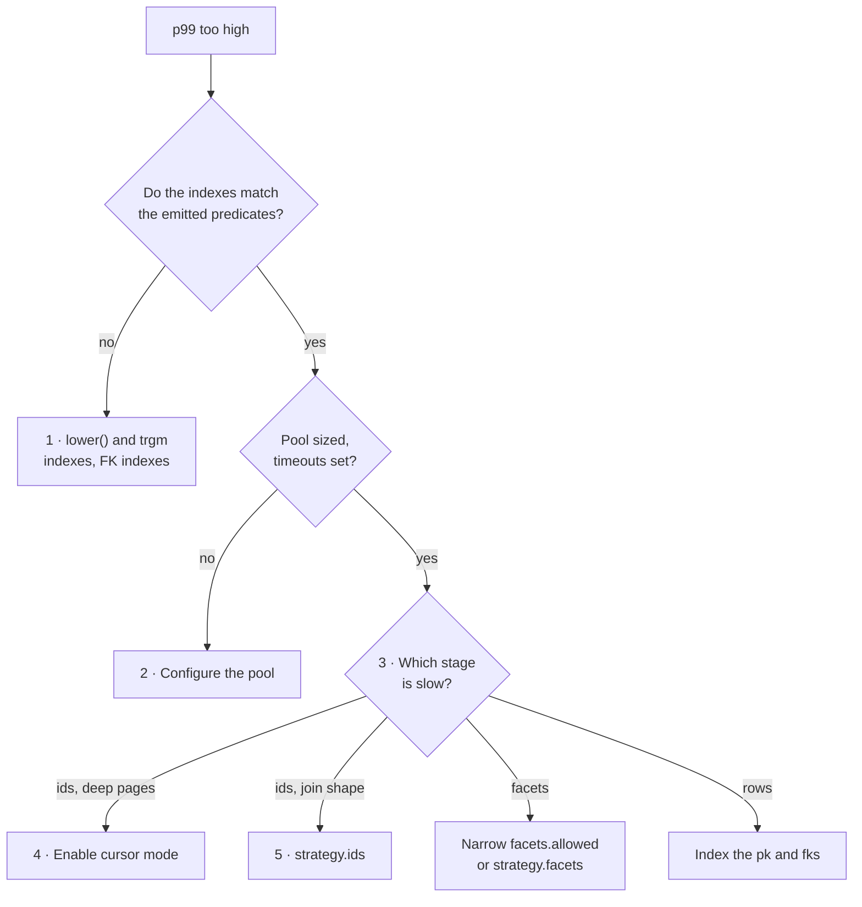

Performance work on a resource has a correct order. Out of order it wastes effort, and raising concurrency before fixing queries makes latency worse.

Work through these five steps in sequence. Each one is cheaper than the one after it, and each one changes what the next measurement tells you.



## 1 · Index what the engine actually emits

Indexes were worth **~8× baseline throughput** in the [benchmarks](/performance/benchmarks) — more than any code change on this page. But they only pay off when the index key matches the predicate the compiler emits.

| Emitted predicate                     | Comes from                                       | Index that serves it                  |
| ------------------------------------- | ------------------------------------------------ | ------------------------------------- |
| `orders.customer_id = customers.id`   | every `one` relation hop                         | btree on the foreign key              |
| `orders.id = order_lines.order_id`    | every `many` path filter                         | btree on the correlation column       |
| `ORDER BY orders.created_at DESC`     | `sorting`                                        | btree on the sort column              |
| `orders.total_amount >= 100`          | `gt` `gte` `lt` `lte` `before` `after` `between` | btree on the column                   |
| `lower(customers.name) = 'acme'`      | `is` `isNot` `isAnyOf` on a text column          | btree on `lower(column)`              |
| `lower(customers.name) LIKE '%acme%'` | `contains`, and all text search                  | GIN with `pg_trgm` on `lower(column)` |

Start with the predicates that compare bare columns, because a plain btree serves them:

```sql
-- Join columns, and the correlation columns EXISTS subqueries use
CREATE INDEX ON orders (customer_id);
CREATE INDEX ON order_lines (order_id);
CREATE INDEX ON order_lines (product_id);

-- Sort columns, which are ordered on the bare column
CREATE INDEX ON orders (created_at);

-- Range filters, and a partial index for the soft-delete scope
CREATE INDEX ON orders (total_amount);
CREATE INDEX ON orders (deleted_at) WHERE deleted_at IS NULL;
```

Those cover the ids stage's joins and ordering, which is where the benchmark gain came from.

### Text predicates need expression indexes

Every text comparison lowercases the column. `is`, `isNot`, and `isAnyOf` on a text column compile to `lower(column) = 'value'`, and `contains` — the operator all text search runs through — compiles to `lower(column) LIKE '%value%'`. The value is lowercased before it is bound, so the transformation always sits on the **left** side.

Index the expression, not the column:

```sql
-- Serves is / isNot / isAnyOf, and any anchored LIKE you write yourself
CREATE INDEX ON customers (lower(name));
CREATE INDEX ON orders (lower(status));

-- Serves contains and text search, which lead with a wildcard
CREATE EXTENSION IF NOT EXISTS pg_trgm;
CREATE INDEX ON customers USING gin (lower(name) gin_trgm_ops);
CREATE INDEX ON orders USING gin (lower(reference) gin_trgm_ops);
```

The btree handles equality; the GIN trigram index is the only one of the two that can help a leading `%`.

::caution
An earlier version of this page recommended `CREATE INDEX ON customers(name)` for name search. That index serves none of the text predicates the engine emits. The predicate's left side is `lower(customers.name)`, an expression, and Postgres only uses a btree whose key matches that expression exactly — so a bare-column index is skipped and the scan stays sequential. There is no `ILIKE` anywhere in the compiler, which is why the usual "just add an index" advice does not transfer.
::

::note
`contains` on a non-text column compiles to `lower(cast(column as text))`. No ordinary index applies, and the cast defeats the column's own btree. Filter numbers and timestamps with the range operators instead.
::

## 2 · Configure the connection pool explicitly

An implicit pool can flatten throughput at medium concurrency long before the queries are the problem. Set the limits and the timeouts yourself:

```ts twoslash
/** Options for the `pg` driver's connection pool. */
export const poolOptions = {
  connectionTimeoutMillis: 5_000,
  idleTimeoutMillis: 30_000,
  max: 10,
  min: 2,
  query_timeout: 10_000,
  statement_timeout: 10_000,
};
```

The two timeouts matter more than the sizes — without them one slow facet query holds a connection through a traffic spike and starves every other request.

::warning
Set `max` conservatively. The [benchmarks](/performance/benchmarks) show that widening the pool to an explicit 15 made heavy-facet scenarios **significantly worse**, because more expensive aggregations reached the database at once. Start at `max: 8–10` and raise it only when you see connection queueing rather than query slowness.
::

## 3 · Measure the stages yourself

`drizzle-resource` emits no timings. There is no built-in instrumentation to switch on, so the measurement is yours to add — and guessing which stage is slow is how the wrong optimization gets written.

Wrap a stage with a strategy that delegates to the built-in helper and records the duration:

```ts twoslash
import { engine } from "./engine";
import { ordersRelations } from "./orders.resource";
// ---cut-before---
/** Your metrics sink — a histogram, a log line, a span. */
declare function recordDuration(stage: string, ms: number): void;

export const timedOrders = engine.defineResource("orders", {
  relations: ordersRelations,
  query: {
    scope: (f, ctx) => f.is("customer.orgId", ctx.orgId),
  },
  strategy: {
    ids: async ({ request, utils }) => {
      const startedAt = Date.now();
      const result = await utils.executeIdsQuery({ request });
      recordDuration("ids", Date.now() - startedAt);
      return result;
    },
  },
});
```

`utils.executeIdsQuery` is the same call the automatic pipeline makes, so the wrapper measures without changing behavior. The same shape works for `strategy.rows` and `strategy.facets`.

Measure at the database too. The CTE names are literal in the emitted SQL — `matching_ids`, `facet_matching_ids_0`, `facet_buckets_0_customer_name` — so `pg_stat_statements` separates the stages without any application changes.

Then read the numbers against these thresholds:

| Observation                                      | Read it as                                 | Next move                                   |
| ------------------------------------------------ | ------------------------------------------ | ------------------------------------------- |
| Ids stage p99 over 200ms at moderate concurrency | The join shape or the offset is the cost   | Step 4, then step 5                         |
| A single facet over 1s                           | The grouped column's cardinality           | Smaller `limit`, or narrow `facets.allowed` |
| Every facet slow together                        | One aggregation per facet, all at once     | Fewer facets per request                    |
| Rows stage slow                                  | A missing primary-key or foreign-key index | Back to step 1                              |

[Execution Cost](/performance/execution-cost) maps each of those symptoms to the statement behind it.

## 4 · Switch deep pagination to cursor mode

`OFFSET 5000` makes Postgres produce and discard 5,000 ordered rows before returning a page. Cursor mode replaces the offset with a keyset predicate, so page 200 costs what page 1 costs.

Opt in on the resource — offset is the only mode enabled by default:

```ts twoslash
import { engine } from "./engine";
// ---cut-before---
const orders = engine.defineResource("orders", {
  relations: { customer: true },
  query: {
    defaults: { pagination: { mode: "cursor", pageSize: 25 } },
    pagination: { modes: ["cursor", "offset"] },
    sort: { defaults: [{ dir: "desc", key: "createdAt" }] },
  },
});
```

Listing both modes keeps offset available for the pages a UI still needs to jump to, while the default path stops paying for deep offsets.

Cursor mode also defaults `count` to `"none"`, which drops the exact-count statement, and the engine appends an `id` tiebreaker to the sort so the ordering is total. It requires a visible, sortable root `id` — `defineResource` throws at definition time otherwise.

::tip
An earlier version of this page told you to hand-write keyset pagination inside `strategy.ids`. That advice is **obsolete**. Cursor mode is built in, it encodes and validates the cursor for you, and it needs no custom SQL — see [Pagination](/query-contract/pagination).
::

The trade-off is real: a cursor cannot jump to an arbitrary page number. Use it for infinite lists and exports, and keep offset for tables with a page picker.

## 5 · Write a custom `strategy.ids`

Reach for this last, and only with a measurement pointing at the ids stage. A hand-written query for one resource's join shape was worth **~12.7× throughput and ~90% p99** in the [benchmarks](/performance/benchmarks), because the automatic path is general enough to handle any join shape and pays for that generality.

Compose the pieces the engine already compiled rather than re-deriving them:

```ts twoslash
import type { SQL } from "drizzle-orm";
import type { PgColumn } from "drizzle-orm/pg-core";

import { engine } from "./engine";
import { ordersRelations } from "./orders.resource";
// ---cut-before---
/** Your hand-written page query, tailored to this resource's join shape. */
declare function selectOrderIdPage(args: {
  limit: number;
  offset: number;
  orderBy: Array<SQL | PgColumn | SQL.Aliased<unknown>>;
  where: SQL | undefined;
}): Promise<string[]>;

export const tunedOrders = engine.defineResource("orders", {
  relations: ordersRelations,
  query: {
    pagination: { modes: ["offset"] },
    scope: (f, ctx) => f.is("customer.orgId", ctx.orgId),
  },
  strategy: {
    ids: async ({ request, utils }) => {
      const pageSize = request.pagination.pageSize;
      const pageIndex = request.pagination.mode === "offset" ? request.pagination.pageIndex : 1;

      // One extra id decides whether another page exists, exactly as the engine does
      const selected = await selectOrderIdPage({
        limit: pageSize + 1,
        offset: (pageIndex - 1) * pageSize,
        orderBy: utils.compileOrderBy(request.sorting),
        where: utils.buildWhereClause(request),
      });
      const ids = selected.slice(0, pageSize);

      return {
        ids,
        pageInfo: {
          count: "none",
          hasNextPage: selected.length > pageSize,
          mode: "offset",
          pageIndex,
          pageSize,
          rowCount: null,
        },
      };
    },
  },
});
```

`buildWhereClause` takes the whole request, so scope filters, client filters, and the search predicate all stay enforced — a strategy that rebuilds the `WHERE` clause by hand is how tenancy leaks.

You now own the `pageInfo` contract. Return the mode the request asked for, and set `rowCount` to `null` whenever `count` is `"none"`. [Strategies](/resource-setup/strategies) covers both pagination modes in full.

## Anti-patterns

- **Do not write a strategy before measuring.** Step 5 was ~12× on the facet-free scenario and well under 2× on every faceted one.
- **Do not index the bare text column** and expect search to use it. The predicate is an expression.
- **Do not raise pool `max` to fix slow queries.** More connections against an expensive aggregation is exactly what widening the pool did to the facet scenarios in stage 2.
- **Do not drop a facet from `facets.allowed`** before trying a smaller `limit` or an index on the grouped column.
- **Do not add `many` paths to `sort.disabled`** as an optimization. They are structurally non-sortable already, so the entry does nothing.
- **Do not ask for `count: "exact"` on an infinite list.** The count statement scans the whole filtered set on every page.
- **Do not write `strategy.query`** unless the staged pipeline genuinely does not fit the endpoint. It replaces the ids and rows stages together, and you inherit both contracts.

## When facets are fundamentally too expensive

Grouped aggregation through a junction table has a floor. The many-to-many facet scenario never came in under 2,051ms p99 at 10 connections in any benchmark stage, including the hand-tuned one.

If such a facet is essential to the UI and measurement keeps it over several seconds at moderate concurrency, stop tuning the query and change the shape of the problem:

- A **pre-aggregated table or materialized view** for that one facet, refreshed on write or on a schedule
- A **search-oriented backend** for the faceted explorer specifically, while `drizzle-resource` keeps serving the simpler table endpoints
- **Throttling** facet requests at the API layer, so the expensive path cannot be triggered on every keystroke

## Next steps

- [Execution Cost](/performance/execution-cost) — the statement behind each symptom
- [Benchmarks](/performance/benchmarks) — the measurements these steps are ranked by
- [Strategies](/resource-setup/strategies) — the full `strategy.ids` surface and both pagination modes
- [Pagination](/query-contract/pagination) — cursor mode, count policy, and cursor invalidation
