# Benchmark Results

This page captures measured benchmark results for `@exassess/drizzle-query-resource` using the `employees` resource in this repo.

These numbers are not universal. They are meant to show the kinds of performance differences you can see between:

- the built-in automatic ids planner
- a tailored manual `strategy.ids`

## Scope

Compared modes:

- `automatic IDs strategy`
  - uses the package default ids path
- `manual IDs strategy`
  - uses a custom `strategy.ids` for the resource

The public API contract stayed the same in both modes.

## Benchmark Setup

Resource:

- `employees`

Scenarios:

- `baseline-no-facets`
- `two-cheap-facets`
- `m2m-skill-facet`
- `filtered-mixed-facets`
- `facet-self-inclusion`
- `deep-page-mixed-facets`

Run settings:

- warmup: `3s`
- measurement: `10s`
- concurrency: `10`, `25`, `50`

Raw benchmark artifacts remain in:

- [`apps/api/benchmarks/results`](/Users/cyprienthao/Documents/DEV/ORGANISATIONS/EXASSESS/adonis-starter-kit-main/apps/api/benchmarks/results)

Supporting internal report:

- [`report-auto-vs-manual-ids-2026-03-27.md`](/Users/cyprienthao/Documents/DEV/ORGANISATIONS/EXASSESS/adonis-starter-kit-main/apps/api/benchmarks/report-auto-vs-manual-ids-2026-03-27.md)

## Executive Summary

For the benchmarked `employees` resource, the manual `strategy.ids` was materially faster than the built-in automatic ids planner.

This was especially visible on:

- baseline non-faceted traffic
- relation-heavy sorting/filtering
- many-to-many facet cases under concurrency

## Selected Comparison

| Scenario | Auto RPS | Manual RPS | Auto p99 | Manual p99 |
|---|---:|---:|---:|---:|
| baseline, 10 concurrency | 17.2 | 219.7 | 928ms | 92ms |
| baseline, 25 concurrency | 15.1 | 229.6 | 2136ms | 183ms |
| baseline, 50 concurrency | 14.1 | 240.9 | 4504ms | 409ms |
| m2m skill facet, 25 concurrency | 4.7 | 8.2 | 6427ms | 3535ms |

## Visual Summary

### Baseline p99

```mermaid
xychart-beta
    title "Baseline p99 Latency"
    x-axis ["10 conn", "25 conn", "50 conn"]
    y-axis "ms" 0 --> 5000
    bar [928, 2136, 4504]
    bar [92, 183, 409]
```

Series order:

- automatic IDs strategy
- manual IDs strategy

### Baseline throughput

```mermaid
xychart-beta
    title "Baseline Throughput"
    x-axis ["10 conn", "25 conn", "50 conn"]
    y-axis "RPS" 0 --> 260
    bar [17.2, 15.1, 14.1]
    bar [219.7, 229.6, 240.9]
```

### Many-to-many skill facet p99

```mermaid
xychart-beta
    title "m2m Skill Facet p99"
    x-axis ["10 conn", "25 conn", "50 conn"]
    y-axis "ms" 0 --> 10000
    bar [2516, 6427, 0]
    bar [2124, 3535, 9319]
```

`0` means the automatic mode fully timed out in that run.

## What To Take From This

These results do not mean the built-in automatic mode is bad.

They do mean:

- the automatic mode is the right default starting point
- relation-heavy resources still need benchmarking
- a tailored `strategy.ids` can produce a very large improvement without changing the public API
- many-to-many facets remain expensive even after ids optimization

## Recommended Interpretation

Use automatic mode by default.

Escalate to `strategy.ids` when:

- ids/count queries dominate latency
- relation-path sorting or filtering is hot
- benchmark evidence shows the generic planner is leaving a large gap

For broader package guidance, see:

- [Performance Guide](./performance-guide.md)
