# Query Engine Benchmark Report After Deeper Engine Optimization

Date: 2026-03-27

This report adds a fourth measurement stage:

1. original engine
2. indexes + explicit pooling
3. deeper engine optimization on facet execution

References:

- Original benchmark: [report-2026-03-27.md](/Users/cyprienthao/Documents/DEV/ORGANISATIONS/EXASSESS/adonis-starter-kit-main/apps/api/benchmarks/report-2026-03-27.md)
- After indexes + pooling: [report-after-indexes-and-pooling-2026-03-27.md](/Users/cyprienthao/Documents/DEV/ORGANISATIONS/EXASSESS/adonis-starter-kit-main/apps/api/benchmarks/report-after-indexes-and-pooling-2026-03-27.md)
- Production breakdown: [production-readiness-report-2026-03-27.md](/Users/cyprienthao/Documents/DEV/ORGANISATIONS/EXASSESS/adonis-starter-kit-main/apps/api/benchmarks/production-readiness-report-2026-03-27.md)

New benchmark artifacts:

- [benchmark-report-1774639985342.json](/Users/cyprienthao/Documents/DEV/ORGANISATIONS/EXASSESS/adonis-starter-kit-main/apps/api/benchmarks/results/benchmark-report-1774639985342.json)
- [benchmark-report-1774640098215.json](/Users/cyprienthao/Documents/DEV/ORGANISATIONS/EXASSESS/adonis-starter-kit-main/apps/api/benchmarks/results/benchmark-report-1774640098215.json)
- [benchmark-report-1774640208207.json](/Users/cyprienthao/Documents/DEV/ORGANISATIONS/EXASSESS/adonis-starter-kit-main/apps/api/benchmarks/results/benchmark-report-1774640208207.json)

## What Changed In The Engine

The API surface stayed the same.

Internal changes:

- the main count + page-id flow already used a shared `matching_ids` CTE
- facet resolution now groups facets by their effective scoped request
- grouped facets share a filtered universe rather than rebuilding it independently
- each facet now computes bucket rows and total bucket count in a single query path
- this removes the extra per-facet total query

In other words:

- before deeper engine optimization: roughly `2 queries per facet`
- after deeper engine optimization: roughly `1 query per facet`

## Executive Summary

The deeper engine optimization helped, but mostly at low concurrency.

What improved:

- some facet-heavy scenarios at `10` connections
- especially the many-to-many skill facet
- `facet-self-inclusion` remained the healthiest facet case

What did not improve enough:

- medium/high concurrency heavy facet usage
- deep-page mixed facets
- timeout behavior at `50` connections

The overall conclusion is:

- the engine changes are directionally correct
- they are not yet enough to make heavy faceting high-concurrency ready
- the remaining bottleneck is still the fundamental cost of grouped facet aggregation under load

## Visual Overview

### Baseline Path Across Stages

```mermaid
xychart-beta
    title "Baseline p99 Latency Across Stages"
    x-axis ["10 conn", "25 conn", "50 conn"]
    y-axis "ms" 0 --> 2500
    bar [536, 1060, 2248]
    bar [81, 180, 292]
    bar [82, 183, 320]
```

Series order:

- original
- indexes + pooling
- deeper engine optimization

### Many-to-Many Skill Facet Across Stages

```mermaid
xychart-beta
    title "m2m Skill Facet p99 Across Stages"
    x-axis ["10 conn", "25 conn", "50 conn"]
    y-axis "ms" 0 --> 10000
    bar [2051, 3461, 7408]
    bar [2907, 7026, 9807]
    bar [2613, 7073, 0]
```

`0` means the run fully timed out and did not produce a meaningful p99.

### Two Cheap Facets Across Stages

```mermaid
xychart-beta
    title "Two Cheap Facets p99 Across Stages"
    x-axis ["10 conn", "25 conn", "50 conn"]
    y-axis "ms" 0 --> 10000
    bar [1526, 3389, 6648]
    bar [2213, 5413, 9918]
    bar [2128, 5820, 9878]
```

## Results By Stage

## 10 Connections

| Scenario | Original p99 | Pool+Idx p99 | Engine p99 | Original RPS | Pool+Idx RPS | Engine RPS |
|---|---:|---:|---:|---:|---:|---:|
| baseline-no-facets | 536ms | 81ms | 82ms | 29.42 | 259.50 | 246.17 |
| two-cheap-facets | 1526ms | 2213ms | 2128ms | 9.17 | 5.92 | 6.00 |
| m2m-skill-facet | 2051ms | 2907ms | 2613ms | 7.42 | 4.84 | 5.00 |
| filtered-mixed-facets | 2200ms | 2682ms | 2706ms | 5.84 | 5.00 | 4.84 |
| facet-self-inclusion | 1540ms | 1307ms | 1292ms | 9.67 | 10.50 | 10.09 |
| deep-page-mixed-facets | 3245ms | 5078ms | 5119ms | 4.59 | 2.50 | 2.50 |

## 25 Connections

| Scenario | Original p99 | Pool+Idx p99 | Engine p99 | Original RPS | Pool+Idx RPS | Engine RPS |
|---|---:|---:|---:|---:|---:|---:|
| baseline-no-facets | 1060ms | 180ms | 183ms | 29.75 | 237.59 | 211.92 |
| two-cheap-facets | 3389ms | 5413ms | 5820ms | 8.75 | 5.42 | 5.00 |
| m2m-skill-facet | 3461ms | 7026ms | 7073ms | 8.42 | 4.34 | 4.17 |
| filtered-mixed-facets | 4376ms | 7238ms | 7477ms | 6.25 | 4.09 | 3.92 |
| facet-self-inclusion | 2649ms | 3500ms | 3398ms | 11.92 | 9.75 | 9.67 |
| deep-page-mixed-facets | 6082ms | 9860ms | 9728ms | 4.59 | 1.42 | 1.25 |

## 50 Connections

| Scenario | Original p99 | Pool+Idx p99 | Engine p99 | Original RPS | Pool+Idx RPS | Engine RPS | Engine Errors |
|---|---:|---:|---:|---:|---:|---:|---:|
| baseline-no-facets | 2248ms | 292ms | 320ms | 28.42 | 231.84 | 203.67 | 0 |
| two-cheap-facets | 6648ms | 9918ms | 9878ms | 8.34 | 3.09 | 2.17 | 24 |
| m2m-skill-facet | 7408ms | 9807ms | timeout | 7.59 | 0.25 | 0.00 | 50 |
| filtered-mixed-facets | 9495ms | timeout | timeout | 4.42 | 0.00 | 0.00 | 50 |
| facet-self-inclusion | 6264ms | timeout | timeout | 8.59 | 0.00 | 0.00 | 50 |
| deep-page-mixed-facets | 9961ms | timeout | timeout | 2.92 | 0.00 | 0.00 | 50 |

## Interpretation

### 1. The Engine Work Helped At Low Concurrency

At `10` connections:

- `two-cheap-facets` improved slightly versus pool+idx
- `m2m-skill-facet` improved meaningfully
  - p99 `2907ms -> 2613ms`
  - RPS `4.84 -> 5.00`
- `facet-self-inclusion` improved slightly again

That means removing the second per-facet query is a real win.

### 2. The Engine Work Did Not Solve High-Concurrency Heavy Faceting

At `25-50` connections:

- heavy facet scenarios are still dominated by the cost of grouped bucket aggregation
- the one-query-per-facet version is still too expensive under broad concurrency
- especially when the facet path is many-to-many or mixed with deep pages

This is why:

- low-concurrency improvements are visible
- high-concurrency results are still unstable

### 3. The Baseline Path Remains Healthy

The deeper engine work did not significantly hurt the baseline path.

That is good news:

- the refactor did not regress the simple case materially
- the baseline path remains dramatically better than the original implementation

### 4. The Remaining Problem Is The Cost Of Facet Aggregation Itself

The remaining expensive work is:

- grouping buckets
- `count(distinct ...)`
- many-to-many joins
- repeated facet aggregations under concurrency

So the next gains will not come from shaving more round trips alone.

They will come from changing how facet aggregation itself is modeled.

## What This Means

The engine is better than it was, but the system is still not built for:

- heavy multi-facet exploration
- broad high-concurrency analytical behavior
- deep-page faceting under burst load

For your real-world app shape, where most tables are in the low-thousands and the largest are around `50k`, this is much less alarming than it looks in the benchmark.

But for worst-case heavy faceting, the limitations remain real.

## Recommendation After This Stage

### Keep

- indexes
- explicit pooling
- explicit statement/query timeouts
- the shared-universe engine refactor
- the one-query-per-facet optimization

### Change Next

1. Lower pool pressure for the current production default.

Until the engine is optimized further, I would still cap the pool more conservatively:

- `pool.max=8-10`

2. Add request guardrails.

- max facet count
- max page size
- max deep offset

3. Optimize by data shape, not just SQL plumbing.

The next real optimization layer should target:

- many-to-many facets specifically
- broad bucket aggregation cost
- lightweight list-row projection

## What The Next Engine Layer Would Be

If we keep pushing engine work, the next serious step is not another small SQL refactor.

It is one of these:

### Option A: Specialized many-to-many facet plan

Build a dedicated fast path for paths like:

- `employeeSkills.skill.label`

That path is still the clearest hotspot.

### Option B: Pre-aggregated or materialized facet helpers

If some facet combinations are common, materialized support tables or views can cut repeated runtime aggregation cost heavily.

### Option C: Lighter row strategy for list endpoints

Reduce the base cost further so more concurrency budget is available for facets.

## Bottom Line

The deeper engine optimization was worth doing.

It gave:

- cleaner internal structure
- lower per-facet query count
- measurable low-concurrency improvements

But it did not magically make heavy high-concurrency faceting production-ready.

The current truth is:

- normal table workloads: much better than where we started
- moderate facet workloads: acceptable on moderate-sized tables
- extreme facet workloads: still need either specialized engine work or a search-oriented backend
