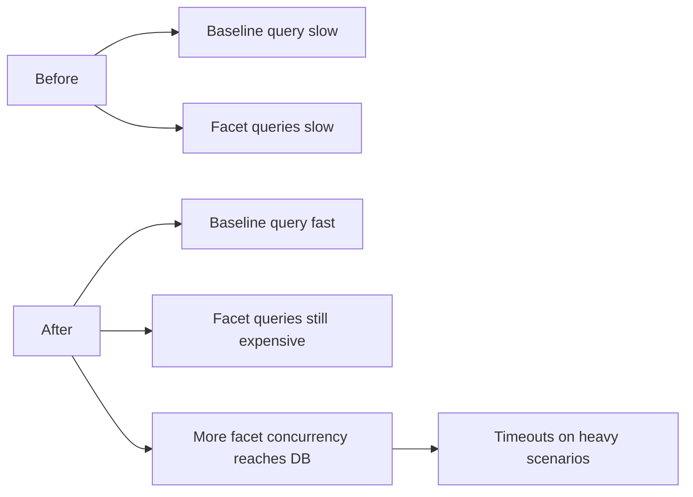
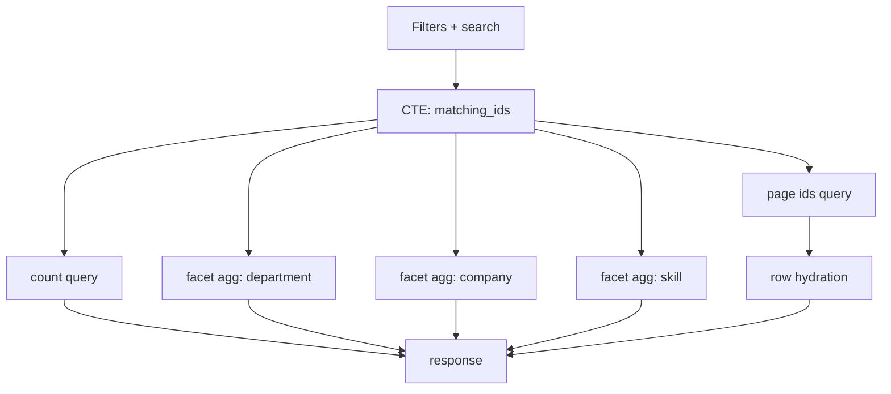

# Query Engine Benchmark Report After Indexing And Pooling

Date: 2026-03-27

This report compares the original benchmark run against the updated setup with:

- explicit `pg.Pool` configuration
- hot-path indexes on the HR schema
- larger Postgres container resources

Reference reports:

- Before: [report-2026-03-27.md](/Users/cyprienthao/Documents/DEV/ORGANISATIONS/EXASSESS/adonis-starter-kit-main/apps/api/benchmarks/report-2026-03-27.md)
- Production breakdown: [production-readiness-report-2026-03-27.md](/Users/cyprienthao/Documents/DEV/ORGANISATIONS/EXASSESS/adonis-starter-kit-main/apps/api/benchmarks/production-readiness-report-2026-03-27.md)

New raw benchmark artifacts:

- [benchmark-report-1774637602925.json](/Users/cyprienthao/Documents/DEV/ORGANISATIONS/EXASSESS/adonis-starter-kit-main/apps/api/benchmarks/results/benchmark-report-1774637602925.json)
- [benchmark-report-1774637707092.json](/Users/cyprienthao/Documents/DEV/ORGANISATIONS/EXASSESS/adonis-starter-kit-main/apps/api/benchmarks/results/benchmark-report-1774637707092.json)
- [benchmark-report-1774637818213.json](/Users/cyprienthao/Documents/DEV/ORGANISATIONS/EXASSESS/adonis-starter-kit-main/apps/api/benchmarks/results/benchmark-report-1774637818213.json)

## Executive Summary

The results are mixed, and that is actually very informative.

What improved dramatically:

- baseline non-faceted query performance
- row hydration cost
- count query cost
- page-id query cost

What got worse:

- most facet-heavy scenarios at medium and high concurrency
- timeout/error rates on heavy facet requests at 50 connections
- deep-page mixed facets under concurrency

The reason is not that indexing failed. Indexing clearly helped. The problem is that once the simple path became cheap and the pool was widened, the expensive facet aggregation path became the dominant bottleneck and hit the database more aggressively.

In short:

- indexing fixed the cheap path
- pooling exposed the expensive path
- the next bottleneck is now clearly the facet engine itself

## What Changed

### Application And Driver

- `adonis-drizzle` now creates an explicit `pg.Pool`
- API config now sets:
  - `max=15`
  - `min=2`
  - explicit idle timeout
  - explicit connection timeout
  - `statement_timeout=10000ms`
  - `query_timeout=10000ms`

### Database

Added indexes:

- `employees(department_id)`
- `employees(full_name)`
- `departments(company_id)`
- `departments(name)`
- `companies(name)`
- `employee_skills(employee_id)`
- `employee_skills(skill_id)`
- `employee_skills(employee_id, skill_id)` unique
- `skills(label)`

### Postgres Container

Raised to:

- `4 vCPU`
- `8 GiB RAM`
- `1 GiB shm`
- `shared_buffers=2GB`
- `effective_cache_size=6GB`
- `work_mem=16MB`
- `maintenance_work_mem=512MB`

## Before/After Outcome

### High-Level Takeaway

### Baseline Improvement

This is the biggest win in the rerun.

```mermaid
xychart-beta
    title "Baseline p99 Latency Before vs After"
    x-axis ["10 conn", "25 conn", "50 conn"]
    y-axis "ms" 0 --> 2500
    bar [536, 1060, 2248]
    bar [81, 180, 292]
```

Series order:

- first bar set: before
- second bar set: after

### Baseline Throughput Improvement

```mermaid
xychart-beta
    title "Baseline Average RPS Before vs After"
    x-axis ["10 conn", "25 conn", "50 conn"]
    y-axis "RPS" 0 --> 300
    bar [29.42, 29.75, 28.42]
    bar [259.5, 237.59, 231.84]
```

### Heavy Facet Paths After The Change

```mermaid
xychart-beta
    title "Heavy Facet p99 After Change"
    x-axis ["2 cheap facets", "m2m skill", "filtered mixed", "deep page mixed"]
    y-axis "ms" 0 --> 10000
    bar [2213, 2907, 2682, 5078]
    bar [5413, 7026, 7238, 9860]
    bar [9918, 9807, 0, 0]
```

Series order:

- first bar set: 10 connections
- second bar set: 25 connections
- third bar set: 50 connections

`0` in the last chart means the benchmark run fully timed out for that scenario, so a reliable p99 could not be produced.

## Detailed Comparison

## 10 Connections

| Scenario | Before RPS | After RPS | Delta | Before p99 | After p99 | Delta |
|---|---:|---:|---:|---:|---:|---:|
| baseline-no-facets | 29.42 | 259.50 | +782.1% | 536ms | 81ms | -84.9% |
| two-cheap-facets | 9.17 | 5.92 | -35.4% | 1526ms | 2213ms | +45.0% |
| m2m-skill-facet | 7.42 | 4.84 | -34.8% | 2051ms | 2907ms | +41.7% |
| filtered-mixed-facets | 5.84 | 5.00 | -14.4% | 2200ms | 2682ms | +21.9% |
| facet-self-inclusion | 9.67 | 10.50 | +8.6% | 1540ms | 1307ms | -15.1% |
| deep-page-mixed-facets | 4.59 | 2.50 | -45.5% | 3245ms | 5078ms | +56.5% |

## 25 Connections

| Scenario | Before RPS | After RPS | Delta | Before p99 | After p99 | Delta |
|---|---:|---:|---:|---:|---:|---:|
| baseline-no-facets | 29.75 | 237.59 | +698.6% | 1060ms | 180ms | -83.0% |
| two-cheap-facets | 8.75 | 5.42 | -38.1% | 3389ms | 5413ms | +59.7% |
| m2m-skill-facet | 8.42 | 4.34 | -48.5% | 3461ms | 7026ms | +103.0% |
| filtered-mixed-facets | 6.25 | 4.09 | -34.6% | 4376ms | 7238ms | +65.4% |
| facet-self-inclusion | 11.92 | 9.75 | -18.2% | 2649ms | 3500ms | +32.1% |
| deep-page-mixed-facets | 4.59 | 1.42 | -69.1% | 6082ms | 9860ms | +62.1% |

## 50 Connections

| Scenario | Before RPS | After RPS | Delta | Before p99 | After p99 | Delta | Errors |
|---|---:|---:|---:|---:|---:|---:|---:|
| baseline-no-facets | 28.42 | 231.84 | +715.8% | 2248ms | 292ms | -87.0% | 0 |
| two-cheap-facets | 8.34 | 3.09 | -62.9% | 6648ms | 9918ms | +49.2% | 13 |
| m2m-skill-facet | 7.59 | 0.25 | -96.7% | 7408ms | 9807ms | +32.4% | 47 |
| filtered-mixed-facets | 4.42 | 0.00 | n/a | 9495ms | timeout | n/a | 50 |
| facet-self-inclusion | 8.59 | 0.00 | n/a | 6264ms | timeout | n/a | 50 |
| deep-page-mixed-facets | 2.92 | 0.00 | n/a | 9961ms | timeout | n/a | 50 |

## Why Baseline Got So Much Better

The new indexes hit exactly the baseline query’s hot path:

- sorting by `employees.full_name`
- joining through `department_id`
- joining through `company_id`

The top SQL statements changed substantially:

- row hydration dropped to around `2.3ms` mean in the 50-connection baseline run
- page-id query dropped to around `0.2ms` mean
- count query dropped to around `29.6ms` mean

That is a real and excellent improvement.

## Why Facet Scenarios Did Not Improve

### The Main Reason

Facet-heavy requests are still dominated by grouped aggregation queries such as:

- `count(distinct employees.id)`
- `group by departments.name`
- `group by companies.name`
- `group by skills.label`

And each requested facet still runs:

- one options query
- one total query

So the current engine still multiplies DB work with each facet.

### What Pooling Changed

Before the pool was explicit, the system appeared to flatten early around roughly 10-11 active DB backends.

After making pooling explicit:

- the cheap path became dramatically faster
- the DB had less natural throttling on expensive paths
- more facet work could execute concurrently
- the expensive facet queries became the new limiter

In other words:

- before: the app was queueing cheap and expensive work together
- after: cheap work got fast, but heavy facet work reached the DB more aggressively and began timing out

### Timeout Behavior

The new config introduced explicit:

- `statement_timeout=10000ms`
- `query_timeout=10000ms`

That is good for safety, but it also means the slowest facet-heavy requests now fail fast instead of hanging indefinitely.

That is why the 50-connection heavy scenarios now show many timeouts rather than just very bad latency.

This is operationally safer, but it is not yet product-ready for those workloads.

## Resource And Runtime Findings

In the optimized 50-connection run:

- baseline scenario used only around `404%` peak Postgres CPU and about `169MiB` memory
- heavy facet scenarios still drove CPU to roughly `408%` to `419%`
- heavy facet scenarios used about `307MiB` to `451MiB` memory
- active DB backends still topped out near `11`

Interpretation:

- the baseline path is now much more efficient
- the pool change did not create unlimited DB concurrency
- the expensive facet work still saturates the useful DB workers quickly
- the remaining bottleneck is query shape, not lack of raw container memory

## What We Learned

### Good News

1. The indexing work was absolutely worth doing.
2. Explicit pooling and timeouts are the right production direction.
3. The simple query path is now far healthier.

### Hard Truth

1. The facet engine is now undeniably the dominant problem.
2. Throwing more pool or more DB resources at the current facet execution model will not solve the root issue.
3. For facet-heavy queries, the engine must be optimized next.

## Updated Recommendation

### Keep

- the new indexes
- explicit pool configuration
- explicit statement/query timeouts
- the stronger Postgres container sizing

### Adjust

Until the facet engine is optimized, the current `pool.max=15` is probably too aggressive for this specific workload mix.

Recommended temporary pool target:

- `pool.max=8` to `10`

Why:

- it reduces concurrent heavy facet aggregation pressure
- it protects the DB from timeout storms
- it trades some queueing for better stability on heavy requests

This is not a final performance fix. It is a stability tuning measure.

## Next Engineering Step

The next step is no longer a question of indexing or resource sizing.

It is engine work.

Priority order:

1. Compute the filtered employee universe once.
2. Reuse that same `matching_ids` set across all requested facets.
3. Collapse facet totals into the main facet query where possible.
4. Re-benchmark with the same matrix.

### Target Shape

That change is where the next order-of-magnitude improvement will come from.

## Bottom Line

After indexes and pooling:

- baseline queries are much better
- heavy facet queries are still not production-ready at moderate/high concurrency
- the system is now better instrumented and safer
- the next optimization must be in the query engine itself, not just the infrastructure

If you want, I can take the next step and implement the facet-engine optimization path now:

1. shared `matching_ids` CTE
2. fewer per-facet round trips
3. rerun the same benchmark
4. update the report again with a second before/after comparison
