# Benchmark Report: Automatic IDs Strategy vs Manual IDs Strategy

Date: 2026-03-27

This report compares two modes for the employees resource:

- `automatic IDs strategy`
  - uses the query engine default IDs path
- `manual IDs strategy`
  - uses the custom `strategy.ids` implementation in `employees.table.ts`

The API contract is identical in both modes.

## Test Setup

Switch used:

- `QUERY_RESOURCE_EMPLOYEES_MANUAL_IDS=false` for automatic mode
- `QUERY_RESOURCE_EMPLOYEES_MANUAL_IDS=true` for manual mode

Same benchmark scenarios in both runs:

- `baseline-no-facets`
- `two-cheap-facets`
- `m2m-skill-facet`
- `filtered-mixed-facets`
- `facet-self-inclusion`
- `deep-page-mixed-facets`

Run settings:

- warmup: 3s
- measurement: 10s
- concurrency: 10, 25, 50

Raw benchmark files:

- automatic mode:
  - [benchmark-report-1774642252033.json](/Users/cyprienthao/Documents/DEV/ORGANISATIONS/EXASSESS/adonis-starter-kit-main/apps/api/benchmarks/results/benchmark-report-1774642252033.json)
  - [benchmark-report-1774642343097.json](/Users/cyprienthao/Documents/DEV/ORGANISATIONS/EXASSESS/adonis-starter-kit-main/apps/api/benchmarks/results/benchmark-report-1774642343097.json)
  - [benchmark-report-1774642433093.json](/Users/cyprienthao/Documents/DEV/ORGANISATIONS/EXASSESS/adonis-starter-kit-main/apps/api/benchmarks/results/benchmark-report-1774642433093.json)
- manual mode:
  - [benchmark-report-1774642540231.json](/Users/cyprienthao/Documents/DEV/ORGANISATIONS/EXASSESS/adonis-starter-kit-main/apps/api/benchmarks/results/benchmark-report-1774642540231.json)
  - [benchmark-report-1774642629029.json](/Users/cyprienthao/Documents/DEV/ORGANISATIONS/EXASSESS/adonis-starter-kit-main/apps/api/benchmarks/results/benchmark-report-1774642629029.json)
  - [benchmark-report-1774642718052.json](/Users/cyprienthao/Documents/DEV/ORGANISATIONS/EXASSESS/adonis-starter-kit-main/apps/api/benchmarks/results/benchmark-report-1774642718052.json)

## Executive Summary

The manual IDs strategy wins clearly and consistently.

It is not a small edge. It is a large difference.

Across the benchmark matrix:

- baseline throughput is dramatically higher with the manual IDs strategy
- p99 latency is dramatically lower with the manual IDs strategy
- facet-heavy paths also improve in most cases
- timeout behavior is noticeably better in manual mode

## Visual Summary

### Baseline p99: Auto vs Manual

```mermaid
xychart-beta
    title "Baseline p99 Latency"
    x-axis ["10 conn", "25 conn", "50 conn"]
    y-axis "ms" 0 --> 5000
    bar [928, 2136, 4504]
    bar [92, 183, 409]
```

Series order:

- automatic IDs strategy
- manual IDs strategy

### Baseline RPS: Auto vs Manual

```mermaid
xychart-beta
    title "Baseline Throughput"
    x-axis ["10 conn", "25 conn", "50 conn"]
    y-axis "RPS" 0 --> 260
    bar [17.2, 15.1, 14.1]
    bar [219.7, 229.6, 240.9]
```

### m2m Skill Facet p99: Auto vs Manual

```mermaid
xychart-beta
    title "m2m Skill Facet p99"
    x-axis ["10 conn", "25 conn", "50 conn"]
    y-axis "ms" 0 --> 10000
    bar [2516, 6427, 0]
    bar [2124, 3535, 9319]
```

`0` means the automatic mode fully timed out in that run.

## Detailed Results

## 10 Connections

| Scenario | Auto RPS | Manual RPS | Delta | Auto p99 | Manual p99 | Delta |
|---|---:|---:|---:|---:|---:|---:|
| baseline-no-facets | 17.20 | 219.70 | +1177.3% | 928ms | 92ms | -90.1% |
| two-cheap-facets | 6.40 | 10.80 | +68.8% | 1788ms | 1301ms | -27.2% |
| m2m-skill-facet | 5.20 | 8.20 | +57.7% | 2516ms | 2124ms | -15.6% |
| filtered-mixed-facets | 8.10 | 9.90 | +22.2% | 1616ms | 1441ms | -10.8% |
| facet-self-inclusion | 17.40 | 27.50 | +58.0% | 773ms | 475ms | -38.6% |
| deep-page-mixed-facets | 3.00 | 4.80 | +60.0% | 3986ms | 2644ms | -33.7% |

## 25 Connections

| Scenario | Auto RPS | Manual RPS | Delta | Auto p99 | Manual p99 | Delta |
|---|---:|---:|---:|---:|---:|---:|
| baseline-no-facets | 15.10 | 229.60 | +1420.5% | 2136ms | 183ms | -91.4% |
| two-cheap-facets | 5.20 | 9.00 | +73.1% | 5234ms | 3653ms | -30.2% |
| m2m-skill-facet | 4.70 | 8.20 | +74.5% | 6427ms | 3535ms | -45.0% |
| filtered-mixed-facets | 7.50 | 9.20 | +22.7% | 3787ms | 3603ms | -4.9% |
| facet-self-inclusion | 17.90 | 22.70 | +26.8% | 1704ms | 1457ms | -14.5% |
| deep-page-mixed-facets | 2.50 | 3.90 | +56.0% | 9113ms | 7219ms | -20.8% |

## 50 Connections

| Scenario | Auto RPS | Manual RPS | Delta | Auto p99 | Manual p99 | Delta | Auto Errors | Manual Errors |
|---|---:|---:|---:|---:|---:|---:|---:|---:|
| baseline-no-facets | 14.10 | 240.90 | +1608.5% | 4504ms | 409ms | -90.9% | 0 | 0 |
| two-cheap-facets | 4.91 | 7.80 | +58.9% | 9802ms | 7108ms | -27.5% | 1 | 0 |
| m2m-skill-facet | 0.00 | 5.70 | n/a | timeout | 9319ms | n/a | 50 | 0 |
| filtered-mixed-facets | 5.00 | 5.20 | +4.0% | 9803ms | 8322ms | -15.1% | 0 | 0 |
| facet-self-inclusion | 14.90 | 21.30 | +43.0% | 4540ms | 3005ms | -33.8% | 0 | 0 |
| deep-page-mixed-facets | 1.20 | 5.40 | +350.0% | 9937ms | 8798ms | -11.5% | 38 | 0 |

## What This Means

The custom manual IDs strategy is not just a small micro-optimization.

It is materially better than the current generic engine IDs path for this resource.

That suggests the default IDs path is still paying a cost that the simpler manual strategy avoids.

Most likely reasons:

- the default path now builds a more general-purpose matching-IDs CTE strategy
- the manual path is simpler and very tailored to this resource’s join shape
- the manual strategy avoids some overhead in the generic engine flow for count/page-id selection

## Recommendation

For the employees resource specifically:

- keep the manual `strategy.ids`

For the query engine generally:

- the default IDs path still needs more work if it is expected to match tailored per-resource performance

## Bottom Line

If the question is:

- "Should we use the automatic IDs strategy or the manual optimized one for employees?"

The answer from these benchmarks is:

- use the manual optimized IDs strategy

The difference is large enough that it is worth keeping the custom strategy for this resource.
